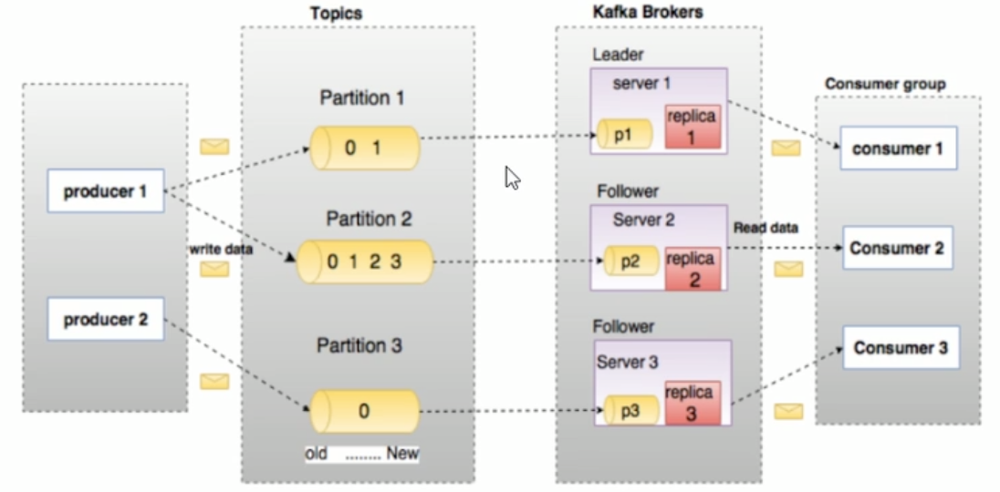
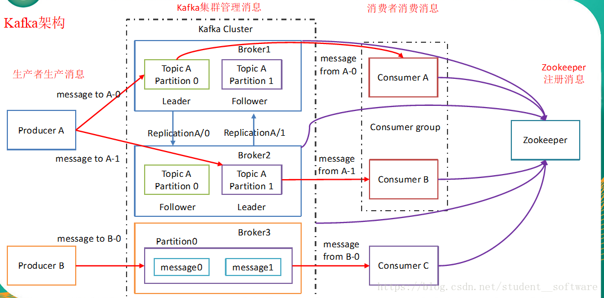
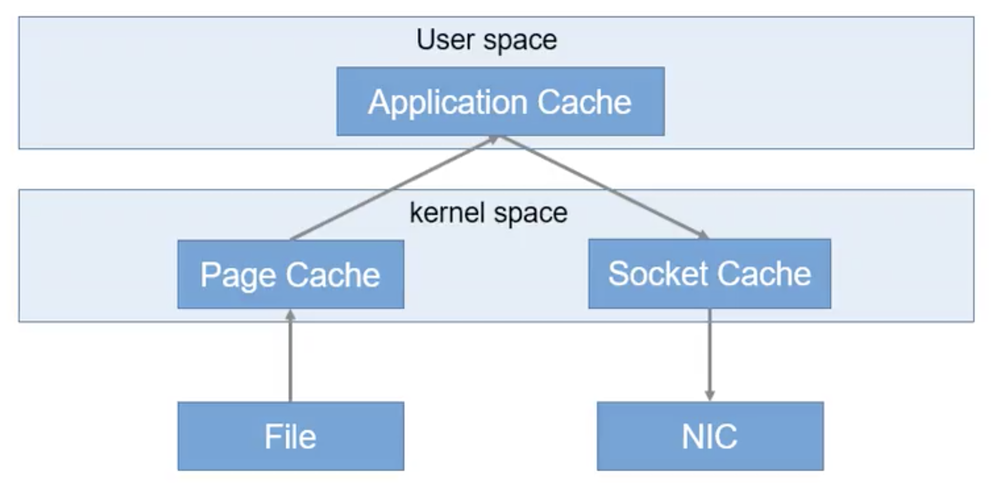
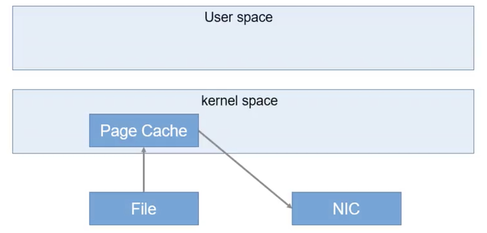

# Kafka

一个分区内的数据才能保证幂等性和有序性

##  架构

## 名次解释
+ Broker：Kafka服务器
+ Producer：生产者，生产消息
+ Consumer：消费者，消费数据
+ Consumer Group：消费者组，某一个分区只能被同一个消费者组内的一个消费者消费
+ Topic：消息主题。逻辑概念
+ Partition：消息分区。消息物理存储上概念
+ Offset：偏移量
+ Replica：副本，同一个分区（Partition）内的副本分Leader和Follower
+ Leader：主副本。对外提供服务
+ Follower：从副本。做数据同步工作
+ acks：acknowledgments，消息接收后的确认值
+ AR（Assigned Replicas）：分区中所有副本
+ ISR（In-Sync Replicas）：所有与Leader 部分保持一定程度的副本（包含Leader副本在内）组成ISR
+ OSR（Out-Sync Replicas）：与Leader副本同步滞后过多的副本
+ HW（High Watermark）：高水位，消费者能见到的最大的offset，只能消费hw之前的数据。ISR队列中最小的LEO。保证消费者消费数据的一致性
+ LSO（log Start Offset）：该副本第一个offset。
+ LEO（Log End Offset）：该副本数据最大偏移量的下一个值（即该副本最新offset+1），里面没要消息。即日志末端位移，记录了该副本底层日志中下一条消息的位移值。注意是下一条消息，也就是说如果LEO=10，那么表示该副本保存了10条消息，位移值范围是[0,9]。日志末端位移，代表日志文件中下一条待写入消息的offset，这个offset上实际是没有消息的。不管是leader副本还是follower副本，都有这个值。当leader副本收到生产者的一条消息，LEO通常会自增1，而follower副本需要从leader副本fetch到数据后，才会增加它的LEO，最后leader副本会比较自己的LEO以及满足条件的follower副本上的LEO，选取两者中较小值作为新的HW，来更新自己的HW值。
>1 Topic = n Partition
>1 Partition = n Replica
>1 Replica = n Segment
>1 Segment = 2 File （ .log ，.index)

## Producer（生产者）

拦截器->序列化器->分区器

kafka无法保证整个topic多个分区有序，但是由于每个分区（partition）内，每条消息都有一个offset，故可以保证分区内有序。
### 写流程

- producer根据分区原则确定自己需要发送到的Partition后，先从broker-list获取该Partition的leader
- producer将消息发送给leader
- leader将该消息写入本地log
- follower从leader pull消息
- 写入本地log后向leader发送ack
- leader收到所有follower的ack后向producer发送ack
### 命令

#### 使用脚本
kafka-console-producer.sh

#### 常用参数
+ --broker-list	//kafka集群地址
+ --topic	//生产主题

#### 举例
kafka-console-producer.sh	--broker-list	localhost:9092	--topic	test

### 分区策略
1. 指定分区（Partition）：直接按照分区号
2. 没有分区（Partition）但是有Key：（默认）根据Key的Hash值获取分区号
3. 即没有分区（Partition）也没有Key：第一次先随机获取一个分区号，然后在这个分区号的基础上轮询所有分区号。
	
	>如果有3个分区，0、1、2当随机获取的分区号为1时，然后1、2、0、1、2、0、1 ... 这样轮询下去

### 发送返回值
ACKS值：
+ 0：Producer不等待Leader所在的Broker的acks，这一操作保证了最低延迟，Leader所在的Broker一接到消息不等消息保存就会先将ack的值返回给Producer。此值下当Leader所在的Broker宕机时会造成数据丢失
+ 1：Producer等待Leader所在的Broker的acks，当Leader所在Broker接收到消息保存完消息后才会将ack值返回给Producer。在Leader的消息落盘后还没等Follower同步数据其所在Broker宕机后，就会导致数据丢失。（默认）
+ -1（all）：Producer等待Leader所在的Broker的acks，当Leader和ISR中的Follower全部将消息落盘之后所在的Broker才会将ack的值返回给Producer。但是如果Follower将消息同步完以后，Leader所在的Broker还没将ack的值返回给Producer之前，Leader所在的Broker发生故障，会造成数据重复

### 幂等性
设置：enable.idempotence=true
解决单次会话单个分区数据重复问题
开启幂等性的Producer在初始化的时候会被分配一个PID，发往同一Partition的消息会附带SequenceNumber，而Broker会对<PID，Partition，SequenceNumber>做缓存，当具有相同主键的消息提及时，Broker只会持久化一条。

## Consumer（消费者）

当前消费者需要提交的消费位移是offset+1

### 命令

#### 使用脚本
kafka-console-consumer.sh	

#### 常用参数
+ --bootstrap-server	//目标服务器地址
+ --topic	//消费主题

#### 举例
kafka-console-consumer.sh	--bootstrap-server	localhost:9092	--topic	test

> kafka-console-consumer.sh --zookeeper zk1:2181,zk2:2181,zk:2181 --topic	test     //kafka 2.2 及以上后不建议使用 --zookeeper

### 分配策略
+ RoundRobin	将订阅的所有主题看作一个整体。（按组分配）
+ Range	将订阅的单个主题看作整体。（按主题分配）

### 消息积压
数据积压主要可以从两个角度去分析：

- 如果是 Kafka 消费能力不足，则可以考虑增加 Topic 的分区数，并且同时提升消费组的消费者数量，消费者数=分区数。（两者缺一不可）

- 如果是下游的数据处理不及时：提高每批次拉取的数量。如果是因为批次拉取数据过少（拉取 数据/处理时间<生产速度），也会使处理的数据小于生产的数据，造成数据积压。

### 保证精准一次消费
在实际情况下，我们对于某些比较重要的消息，需要保证exactly once语义，也就是保证每条消息被发送且仅被发送一次，不能重复。在0.11版本之后，Kafka引入了幂等性机制（idempotent），配合acks = -1时的at least once语义，实现了producer到broker的exactly once语义。
idempotent + at least once = exactly once
使用时，只需将enable.idempotence属性设置为true，kafka自动将acks属性设为-1。

## Topic（主题）

###	命令

#### 使用脚本
kafka-configs.sh	//0.9中已经废弃kafka-topics.sh脚本，改用kafka-configs.sh来配置主题

#### 常用参数
+ --zookeeper	//zookeeper地址，多个用逗号链接
+ --create	//创建命令
+ --list	//列出所有主题
+ --alter	//修改主题
+ --delete	//删除主题
+ --topic	//主题
+ --partitions	//主题分区数，分区数要小于等于broker数
+ --replication-fator	//主题副本数

#### 举例
+ 创建主题：kafka-configs.sh	--zookeeper	localhost:9092	--create	--topic	test	--partition	2	--replication-fator	3
+ 列出所有主题：kafka-configs.sh	--zookeeper	localhost:9092	--list
+ 列出主题详情：kafka-configs.sh	--zookeeper	localhost:9092	--describe	--topic test
+ 修改主题：kafka-configs.sh	--zookeeper	localhost:9092	--alter	--topic test
+ 删除主题：kafka-configs.sh	--zookeeper	localhost:9092	--delete	--topic test

## Kafka高读写

- 顺序读写
- Page Cache
利用操作系统自身的内存
- 零复制
传统应用程序，首先通过系统调用将文件数据读入到内核态Buffer（DMA拷贝），然后应用程序将内存态Buffer数据读入到用户态Buffer（CPU拷贝），接着用户程序通过Socket发送数据时将用户态Buffer数据拷贝到内核态Buffer（CPU拷贝），最后通过DMA拷贝将数据拷贝到NIC Buffer。
kafka，数据通过DMA拷贝到内核态Buffer后，直接通过DMA拷贝到NIC Buffer，无需CPU拷贝
	 
	

- 文件分段
- 批量发送
- 数据压缩

​	