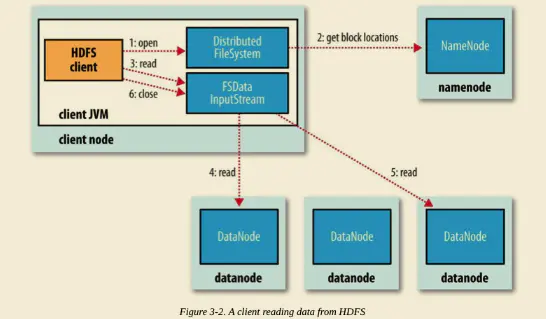
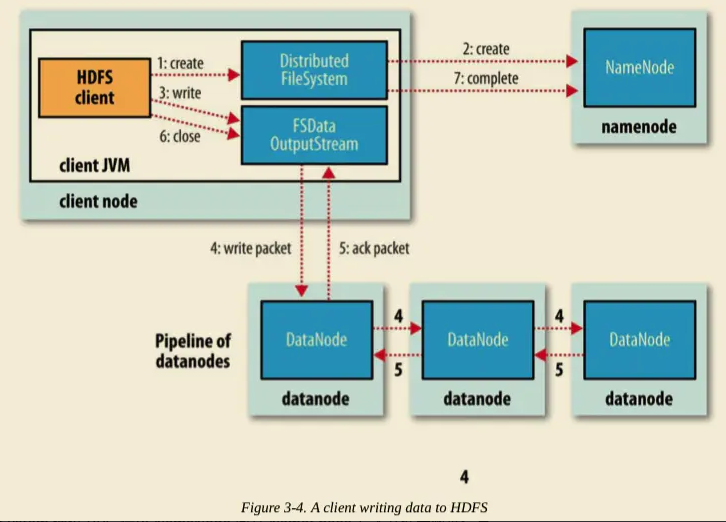
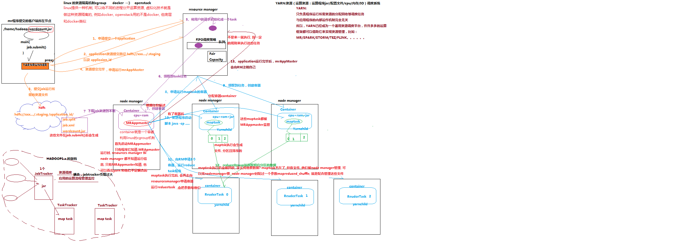
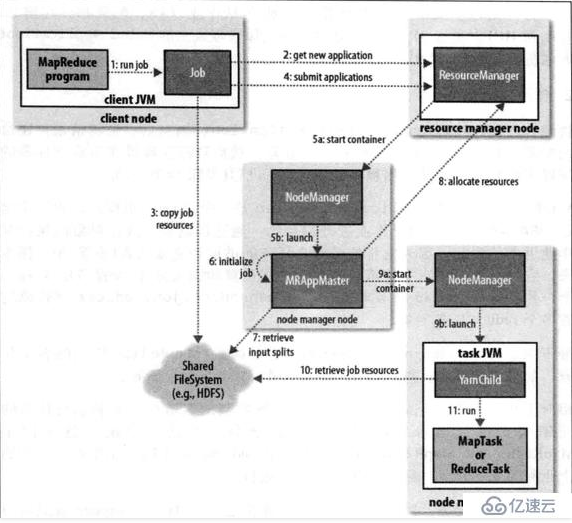

# Hadoop
## HDFS
### 读
- block
文件上传前需要分块，这个块就是block，一般为128MB，

- packet
packet是第二大的单位，它是client端向DataNode，或DataNode的PipLine之间传数据的基本单位，默认64KB。

- chunk
chunk是最小的单位，它是client向DataNode，或DataNode的PipLine之间进行数据校验的基本单位，默认512Byte，因为用作校验，故每个chunk需要带有4Byte的校验位。所以实际每个chunk写入packet的大小为516Byte。由此可见真实数据与校验值数据的比值约为128 : 1。（即64*1024 / 512）
#### 执行过程

- Client 端调用 DistributedFileSystem 对象的 open() 方法。
- 由 DistributedFileSystem 通过 RPC 向 NameNode 请求返回文件的 Block 块所在的 DataNode 的地址。
- Client 端调用 FSDataInputStream 对象的 read() 方法，通过 FSDataInputStream 向 DataNode 获取 Block 数据。之后数据流源源不断地从 DataNode 返回至 Client。当最后一个 Block 返回至 Client 端后， DFSInputStream 会关闭与 DataNode 连接。

### 写
#### 执行过程

- Client 写入文件时，调用 DistributedFileSystem 对象的 create() 方法。
- DistributedFileSystem 通过 RPC 请求 NameNode 向其 NameSpace 写入文件元数据信息。
- NameNode 会做多种检查，如判断文件是否存在，是否有相应的写权限等等。如果检查通过，NameNode 会将文件元数据写入 NameSpace，**操作写入EditLog**。DistributedFileSystem 将会返回 FSDataOutputStream 用于 Client 端直接向 DataNode 写入数据。
- DFSOutputStream 将 Client 要写入的数据分割成 Packets。Packets 会被保存到 Data Queue 队列中，并由 DataStreamer 消费处理。DataStreamer 请求 NameNode 分配 DataNode 列表，将 Packets 写入到 DataNode 中。假设放置副本的默认策略是 3，那么 NameNode 将返回 3 个 DataNode，并串联起来组成一条 Pipeline。 DataStreamer 将 Packets 写入到第一个 DataNode1，DataNode1 存储完后直接转发至 DataNode2，DataNode2 存储完后再直接转发至 DataNode3。（注意，这里直接是 DataNode1 直接将 Packet 转发至 DataNode2。
- DFSOutputStream 为了防止出问题时数据的丢失，维持了一个等待 DataNode 成功写入的 ACK Queue。只有当 Packet 被成功写入 Pipeline 中的每个 DataNode 时，此 Packet 才会从 ACK Queue 中移除。
- 在 Pipeline 写入的过程中，如果某个 DataNode 出现问题，Pipeline 首先将会被关闭，随后在 ACK Queue 中的 Packets 会被添加到 Data Queue 的最前面，用来防止位于问题节点下游的 DataNode 写入时的数据丢失。出问题的 DataNode 会被从 Pipeline 中移除。NameNode 会重新分配一个健康的 DataNode 构成新的 Pipeline。
- 当 Client 端写完数据，调用 DFSOutputStream 对象的 close() 方法。该操作将会将所有剩余的 Packets 刷写到 DataNode Pipeline 并等待返回确认，之后向 NameNode 发送文件写入完成信号。

### 常用命令
- hdfs dfs -ls / //查看某目录下面目录结构
- hdfs dfs -put 	//将文件推送到集群
- hdfs dfs -get 	//从集群上下载文件
- hdfs dfs -mkdir	//创建目录
- hdfs dfs -chmod	//修改文件权限

## MapReduce
### 执行过程
## Yarn
### 集群组件
- ResourceManager
	RM是一个全局的资源管理器,负责整个系统的资源管理和分配。它主要由两个组件构成：调度器（Resource Scheduler）和应用程序管理器（Applications Manager，ASM）
	
- NodeManager
	NM是每个节点上的资源和任务管理器。一方面，它定时地向RM汇报本节点的资源使用情况和Container运行状态；另一方面，它接受并处理来自AM的Container启动/停止等各种请求。
	
- ApplicationMaster
	- 与RM调度器协商以获取资源（以Container表示）
	- 将得到的任务进一步分配给内部的任务
	- 与NM通信以启动/停止Container任务
	- 监控所有任务运行状态，并在任务失败时重新为任务申请资源以重启任务
	
- YarnChild

  集群上运行task的组件

- YarnRunner

  客户端运行程序的组件

#### 调度过程

- 客户端所在的机器 执行 job.submit() ,调用 YarnRunner 去向 ResourceManager 的ApplicationsManager申请提交一个 application。

- RM的ApplicationsManager 返回 一个 资源提交的地址 hdfs://xxx/.staging/application_id/  和 application_id。因为后续的任务需要执行这些个资源文件，到这个阶段，还不了解每个任务到底会分配到哪台机器上，干脆直接给一个都能访问到的地址，任务到谁那里，就自己去这个位置拉取需要的jar 包和 配置信息。

- YarnRunner 根据返回的信息提交 job 所需要的 资源文件到上面的地址（job.split,job.xml,wordcount.jar  这些文件在job.submit()后生成）。

- YarnRunner 提交资源完毕，ApplicationsManager申请启动 MrAppMaster。

- ApplicationsManager收到请求，然后封装成一个 task，与ResourceScheduler通信申请资源，ResourceScheduler将task放入队列中等待执行。（Yarn调度策略，FIFO，Capacity，FariS）。

- task执行获取到资源后，ApplicationsManager与资源NodeManger通信，NM启动Container运行MrAppMaster，MrAppMaster下载job相关的文件，解析任务。

- MrAppMaster向RM的ApplicationsManager进行注册并根据配置信息，去跟 RM 的ResourceScheduler申请运行 maptask 的容器，RM 的ResourceScheduler将资源信息返回给MrAppMaster。

- MrAppMaster根据返回的资源信息与NodeManager进行通信 ,NM会在本地启动  container  容器。

- MrAppMaster  向上步新启动的 容器发送 拷贝文件、执行 maptask 等任务的命令脚本。maptask 执行完成后，把数据写到NM自己本地，执行maptask容器的工作目录。

- MrAppMaster  再向 YARN 请求资源来运行 reducetask 任务。

- reducetask 向 map 端获取相应的分区数据进行处理 （容器向NM索要文件，NM通过mapreduced_shffle，管理这些文件），处理完成后进行输出。

- 整个 applicetion 执行完成后，MrAppMaster 向 ResourceManager 申请销毁自己。

  

  
### 调度器
- FIFO Scheduler （队列调度）

  先进先出，不允许抢占资源，资源利用率不高

- Capacity Scheduler（容器调度）

  划分固定容量，灵活分配资源，当某个队列空闲，其他队列满负荷的情况下，会使用部分该空闲资源运行其他队列的任务

- FairS cheduler（公平调度）

  先运行先利用资源，后来者再通过协调资源，灵活分配资源，当某个队列空闲，其他队列满负荷的情况下，会使用部分该空闲资源运行其他队列的任务

#### 常用命令