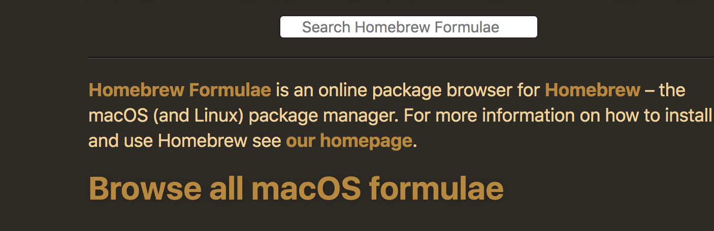

# Go插件工具安装问题

在Mac上在学习使用Go或者安装其他带有Go依赖的安装包时（比如git-lfs）可能会遇到Go插件工具安装问题

下面我们就来解决一下这个问题（网上也有相关使用代理的情况，这里不再说明）

## 引发原因

mac 下的包管理工具brew 可以方便的安装工具包或者相应的软件应用，当使用brew 安装git-lfs（git上传大文件的工具）时，因为依赖Go 语言工具，所以在安装时会报错。下面就brew install git-lfs 时的问题来给出解决方案。

## 过程思路

如果想直接解决可以直接跳转到[解决方案](#解决方案)

在网上搜索时发现https://github.com/golang/tools 是https://go.googlesource.com/tools.git的一个镜像。这样我们只要修改brew下载git-lfs的脚本，将https://go.googlesource.com/tools.git替换成https://github.com/golang/tools 应该就可以解决我们的问题。


登上[Homebrew](https://brew.sh/)的官网，找到Packages，

点击[formulae.brew.sh](https://formulae.brew.sh/)，选择[Browse all macOS formulae](https://formulae.brew.sh/formula/)



在搜索框搜索git-lfs，在页面找到[Formula code](https://github.com/Homebrew/homebrew-core/blob/master/Formula/git-lfs.rb) ，查看git-lfs在GitHub上的脚本源码。

```ruby
class GitLfs < Formula
  desc "Git extension for versioning large files"
  homepage "https://github.com/git-lfs/git-lfs"
  url "https://github.com/git-lfs/git-lfs/releases/download/v2.10.0/git-lfs-v2.10.0.tar.gz"
  sha256 "07fd5c57a1039d5717dc192affbe3268ec2fd03accdca462cb504c0b4194cd23"

  bottle do
    cellar :any_skip_relocation
    sha256 "8fec7d8b8ad7c3332bfa1862dd8615712dab8315a9128ed8b5609fa1659431e7" => :catalina
    sha256 "3c5bcef656ca742c6697b952c9f7c483c1fad046f52136dbe9ee0f16f44835c4" => :mojave
    sha256 "ed0d8f1271d9d81a2c22622023c260ef040f2172e75357893ef54134bc6eedff" => :high_sierra
  end

  depends_on "go" => :build
  depends_on "ruby" => :build

  def install
    ENV["GIT_LFS_SHA"] = ""
    ENV["VERSION"] = version

    (buildpath/"src/github.com/git-lfs/git-lfs").install buildpath.children
    cd "src/github.com/git-lfs/git-lfs" do
      ENV["GEM_HOME"] = ".gem_home"
      system "gem", "install", "ronn"

      system "make", "vendor"
      system "make"
      system "make", "man", "RONN=.gem_home/bin/ronn"

      bin.install "bin/git-lfs"
      man1.install Dir["man/*.1"]
      man5.install Dir["man/*.5"]
      doc.install Dir["man/*.html"]
    end
  end

  def caveats
    <<~EOS
      Update your git config to finish installation:
        # Update global git config
        $ git lfs install
        # Update system git config
        $ git lfs install --system
    EOS
  end

  test do
    system "git", "init"
    system "git", "lfs", "track", "test"
    assert_match(/^test filter=lfs/, File.read(".gitattributes"))
  end
end
```

当前代码中并没有相关https://go.googlesource.com/tools.git的信息，因为当前是Go的tools，所以再去查看Go的安装脚本（git-lfs的脚本中依赖Go和Ruby，所以只有可能是这两个里面有问题，因为tools是Go相关的的工具，所以首先我们可以查看Go的安装脚本）。这是Go语言brew的安装脚本https://github.com/Homebrew/homebrew-core/blob/master/Formula/go.rb

```ruby
class Go < Formula
  desc "Open source programming language to build simple/reliable/efficient software"
  homepage "https://golang.org"

  stable do
    url "https://dl.google.com/go/go1.14.1.src.tar.gz"
    mirror "https://fossies.org/linux/misc/go1.14.1.src.tar.gz"
    sha256 "2ad2572115b0d1b4cb4c138e6b3a31cee6294cb48af75ee86bec3dca04507676"

    go_version = version.to_s.split(".")[0..1].join(".")
    resource "gotools" do
      url "https://go.googlesource.com/tools.git",
          :branch => "release-branch.go#{go_version}"
    end
  end

  bottle do
    sha256 "36fdd54a9307ba19cc69425586e2d63188f2f2b7f541ab9fd2ef3447e376329f" => :catalina
    sha256 "bab387fda3e4683943bd7b9b9208141502d6a2cc42c4b21137effaec9f208e1c" => :mojave
    sha256 "ffb583abeb5263269281532f45a70a074ae0affe6edecb13442024b70bf13b04" => :high_sierra
  end

  head do
    url "https://go.googlesource.com/go.git"

    resource "gotools" do
      url "https://go.googlesource.com/tools.git"
    end
  end

  depends_on :macos => :el_capitan

  # Don't update this unless this version cannot bootstrap the new version.
  resource "gobootstrap" do
    url "https://storage.googleapis.com/golang/go1.7.darwin-amd64.tar.gz"
    sha256 "51d905e0b43b3d0ed41aaf23e19001ab4bc3f96c3ca134b48f7892485fc52961"
  end

  def install
    (buildpath/"gobootstrap").install resource("gobootstrap")
    ENV["GOROOT_BOOTSTRAP"] = buildpath/"gobootstrap"

    cd "src" do
      ENV["GOROOT_FINAL"] = libexec
      ENV["GOOS"]         = "darwin"
      system "./make.bash", "--no-clean"
    end

    (buildpath/"pkg/obj").rmtree
    rm_rf "gobootstrap" # Bootstrap not required beyond compile.
    libexec.install Dir["*"]
    bin.install_symlink Dir[libexec/"bin/go*"]

    system bin/"go", "install", "-race", "std"

    # Build and install godoc
    ENV.prepend_path "PATH", bin
    ENV["GOPATH"] = buildpath
    (buildpath/"src/golang.org/x/tools").install resource("gotools")
    cd "src/golang.org/x/tools/cmd/godoc/" do
      system "go", "build"
      (libexec/"bin").install "godoc"
    end
    bin.install_symlink libexec/"bin/godoc"
  end

  test do
    (testpath/"hello.go").write <<~EOS
      package main
      import "fmt"
      func main() {
          fmt.Println("Hello World")
      }
    EOS
    # Run go fmt check for no errors then run the program.
    # This is a a bare minimum of go working as it uses fmt, build, and run.
    system bin/"go", "fmt", "hello.go"
    assert_equal "Hello World\n", shell_output("#{bin}/go run hello.go")

    # godoc was installed
    assert_predicate libexec/"bin/godoc", :exist?
    assert_predicate libexec/"bin/godoc", :executable?

    ENV["GOOS"] = "freebsd"
    ENV["GOARCH"] = "amd64"
    system bin/"go", "build", "hello.go"
  end
end
```

安装脚本里面有请求https://go.googlesource.com/tools.git地址的信息，我们可以将这块的替换掉应该就可以。

## 解决方案

brew在本地管理安装包的文件夹为

```shell
/usr/local/Cellar/
```

brew在本地管理安装脚本的文件夹为

```shell
/usr/local/Homebrew/Library/Taps/homebrew/homebrew-core/Formula
```

这里我们只需要修改`/usr/local/Homebrew/Library/Taps`下Go的安装脚本，将https://go.googlesource.com/tools.git替换成https://github.com/golang/tools 即可。

```ruby
class Go < Formula
  desc "Open source programming language to build simple/reliable/efficient software"
  homepage "https://golang.org"

  stable do
    url "https://dl.google.com/go/go1.14.1.src.tar.gz"
    mirror "https://fossies.org/linux/misc/go1.14.1.src.tar.gz"
    sha256 "2ad2572115b0d1b4cb4c138e6b3a31cee6294cb48af75ee86bec3dca04507676"

    go_version = version.to_s.split(".")[0..1].join(".")
    resource "gotools" do
    #url "https://go.googlesource.com/tools.git",
    url "https://github.com/golang/tools.git",
          :branch => "release-branch.go#{go_version}"
    end
  end

  bottle do
    sha256 "36fdd54a9307ba19cc69425586e2d63188f2f2b7f541ab9fd2ef3447e376329f" => :catalina
    sha256 "bab387fda3e4683943bd7b9b9208141502d6a2cc42c4b21137effaec9f208e1c" => :mojave
    sha256 "ffb583abeb5263269281532f45a70a074ae0affe6edecb13442024b70bf13b04" => :high_sierra
  end

  head do
      #url "https://go.googlesource.com/go.git"
      url "https://github.com/golang/tools.git"

    resource "gotools" do
        #url "https://go.googlesource.com/tools.git"
      url "https://github.com/golang/tools.git"
    end
  end

  depends_on :macos => :el_capitan

  # Don't update this unless this version cannot bootstrap the new version.
  resource "gobootstrap" do
    url "https://storage.googleapis.com/golang/go1.7.darwin-amd64.tar.gz"
    sha256 "51d905e0b43b3d0ed41aaf23e19001ab4bc3f96c3ca134b48f7892485fc52961"
  end

  def install
    (buildpath/"gobootstrap").install resource("gobootstrap")
    ENV["GOROOT_BOOTSTRAP"] = buildpath/"gobootstrap"

    cd "src" do
      ENV["GOROOT_FINAL"] = libexec
      ENV["GOOS"]         = "darwin"
      system "./make.bash", "--no-clean"
    end

    (buildpath/"pkg/obj").rmtree
    rm_rf "gobootstrap" # Bootstrap not required beyond compile.
    libexec.install Dir["*"]
    bin.install_symlink Dir[libexec/"bin/go*"]

    system bin/"go", "install", "-race", "std"

    # Build and install godoc
    ENV.prepend_path "PATH", bin
    ENV["GOPATH"] = buildpath
    (buildpath/"src/golang.org/x/tools").install resource("gotools")
    cd "src/golang.org/x/tools/cmd/godoc/" do
      system "go", "build"
      (libexec/"bin").install "godoc"
    end
    bin.install_symlink libexec/"bin/godoc"
  end

  test do
    (testpath/"hello.go").write <<~EOS
      package main

      import "fmt"

      func main() {
          fmt.Println("Hello World")
      }
    EOS
    # Run go fmt check for no errors then run the program.
    # This is a a bare minimum of go working as it uses fmt, build, and run.
    system bin/"go", "fmt", "hello.go"
    assert_equal "Hello World\n", shell_output("#{bin}/go run hello.go")

    # godoc was installed
    assert_predicate libexec/"bin/godoc", :exist?
    assert_predicate libexec/"bin/godoc", :executable?

    ENV["GOOS"] = "freebsd"
    ENV["GOARCH"] = "amd64"
    system bin/"go", "build", "hello.go"
  end
end

```

