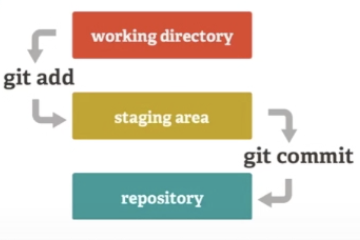

# Git & GitHub


## Git

### init
### clone
### add
将变化提交到working directory（工作区）

- git  add filename 	
  添加file 到working directory

- git add . 
  提交新文件(new)和被修改(modified)文件，不包括被删除(deleted)文件

- git add -u   (git add --update)
  提交被修改(modified)和被删除(deleted)文件，不包括新文件(new)
  
- git add -A  (git add --all)
  提交所有变化，是`git add -u `和`git add . `两个功能的合集（git add --all的缩写）
### commit
将变化提交到staging area（暂存区）

- git commit -m 'init' 
  提交暂存区改变到本地库
  
- git commit -am 'init'
  添加所有改变并提交到本地库

### push
### pull
### diff
比较变化

- git diff 
  比较工作区与本地库中的最后一次提交

- git diff --cached
  比较暂存区与本地库中的最后一次提交

- git diff HEAD
  比较工作区与暂存区
### reset
- git reset filename
  将加入暂存区中的文件撤回到工作区
  
- git reset --hard commitid
  直接回到commitid状态。所有commitid之后的操作全部清空
  
- git reset --hard HEAD^
  回到上次提交的状态，撤销掉最近一次提交
  
### restore
- git restore filename 
  丢弃工作区的改动

### log
查看git 提交日志

- git log
  显示详细提交信息
- git log --oneline
  简单显示提交信息
  
### reflog
如果执行了`git reset --hard commitid`后还想回到commitid以后的某个操作时可以使用此命令，这相当于git log 的log

### checkout
切换到某个提交的节点

- git checkout commitid
  切换到历史的某个commitid的状态。将HEAD的指针指向某个commitid。如果当前状态是master，要想回到master前面某个提交状态，可以使用`git checkout commitid`回到commitid中的操作环境看看。在当前状态修改的操作提交后，如果后期回到master状态，修改的操作会丢失。

- git checkout branchname
  切换到某个分支
  
- git checkout -b branchname
  创建并切换到某个分支
  
- git checkout tagname
  切换到某个标签
  
  
### status
查看当前状态

- git status
  显示当前状态的相信信息

- git status -s 
  显示当前状态的简单信息

### branch
查看创建分之

- git branch
  查看有哪些分支，带*号的为当前分支
  
- git branch name
  创建一个name的分支

### merge
合并分支

- git merge branchname
  合并某个分支到当前分支。山寨过来就是我的，不会保留信息

- git merge branchname --no-ff -m 'init'
  合并某个分支到当前分支，会保留之前分支的提交记录状态和分支信息。山寨人家，但是会保留人家的信息

### tag
给提交添加标签

- git tag tagname
  给当前提交添加标签


### remote
查看远端库信息

- git remote 
  查看远端库简要信息	

- git remote -v //-v == --verbose
  查看远端库信息带有url
  
- git remote add origin url
  添加一个名字为origin 的远端库地址为url
  
  
### push
推送本地库到远端库

- git push
  推送本地master分支到默认远端库分支

- git push -u origin 
  第一次推送时可以使用-u参数，指定默认的远端库，设定以后再提交可以直接使用`git push`
  
- git push  origin master
  推送本地master的分支到名为origin远端库的master分支
  
- git push  origin master1:master2
  推送本地分支master1到origin远端库分支master2
  
- git push  origin :master2
  推送一个空分支到origin远端库分支master2




## GitHub

1. awesome

   ```
   awesome 关键词
   ```

   

2. 

