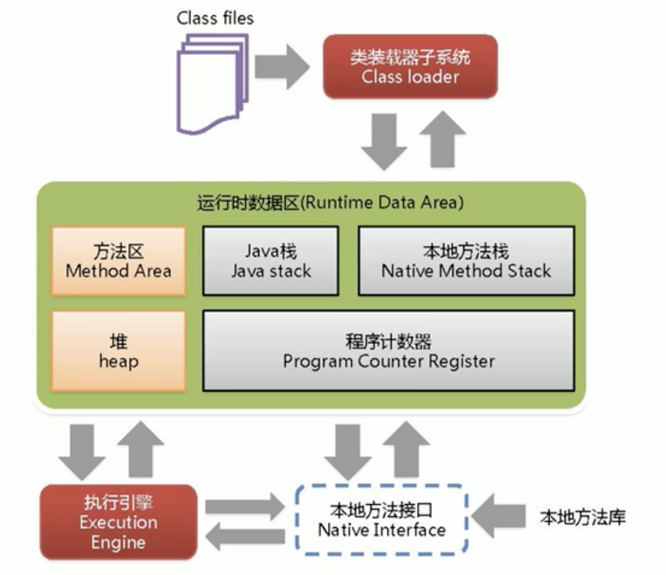
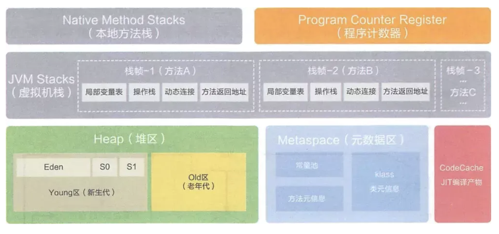
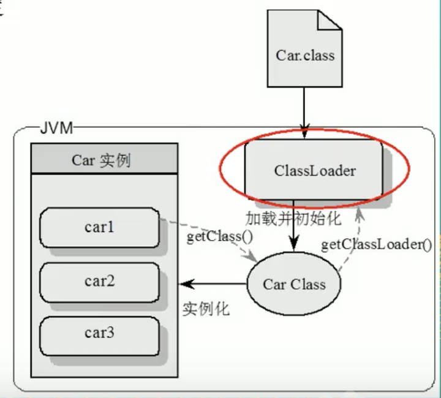
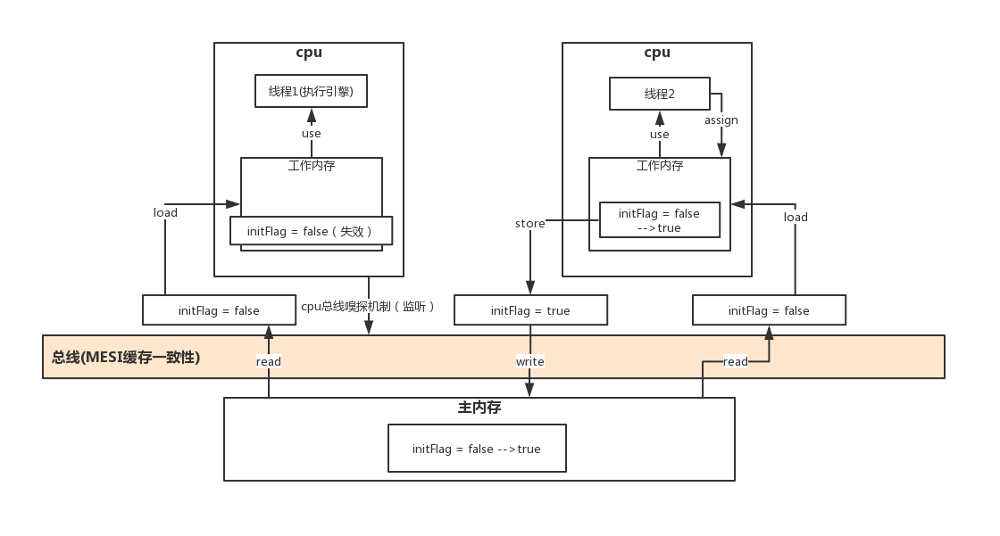

# Java基础知识清单

## JVM
### JVM架构







#### Class file

- 有特定的文件标示（cafe babe），由类加载器加载进JVM方法区
- 在加载类时：静态块（只会加载一次）>构造块>构造方法

#### 类加载器（ClassLoader）

实现通过类的全限定名（java/lang/String）获取该类的二进制字节流的代码块叫做类加载器。

#####分类
###### 启动类加载器（Bootstrap）

用来加载java核心类库，无法被java程序直接引用。主要加载jre/lib文件夹下的jar文件

###### 扩展类加载器（Extension）

它用来加载 Java 的扩展库。Java 虚拟机的实现会提供一个扩展库目录。该类加载器在此目录里面查找并加载 Java 类。主要加载jre/lib/ext文件夹下的jar文件

###### 应用程序加载器（Application）

也叫应用类加载器,它根据 Java 应用的类路径（CLASSPATH）来加载 Java 类。一般来说，Java 应用的类都是由它来完成加载的。可以通过 ClassLoader.getSystemClassLoader()来获取它。

###### 自定义
通过继承 java.lang.ClassLoader类的方式实现。

##### 全盘委托
加载类时，除非显示使用其他类加载器，否则该加载类下的其他依赖都有该类加载器加载

##### 双亲委派
加载时会一层层向上委托，如果可以加载就进行加载，没有就向下层加载器找，找到加载找不到class not found

##### 沙箱安全

自己加载自己的，相当一个一个容器 各不影响

#### 本地接口（Native Interface）
本地接口的作用是融合不同的编程语言为Java所用，在本地方法栈（Native Method Stack） 中登记Native方法

#### 程序计数器（Program Counter Register）,PC 寄存器
线程私有的。内存空间小，字节码解释器工作时通过改变这个计数值可以选取下一条需要执行的字节码指令，分支、循环、跳转、异常处理和线程恢复等功能都需要依赖这个计数器完成。该内存区域是唯一一个java虚拟机规范没有规定任何OOM情况的区域。
记录了方法之间的调用和执行情况，它是当前线程所执行的字节码的行号指示器。相当于一个指针，指示字节码的行号，指引程序执行顺序，native 的为空

#### 本地方法栈（Native Method Stack）
本地方法栈和虚拟机栈类似，只不过本地方法栈为Native方法服务，存放本地方法

#### Java 栈（Java Stack ），虚拟机栈
栈分为java虚拟机栈和本地方法栈
栈管运行，堆管存储。栈也叫栈内存，主管Java程序的运行，是在线程创建时创建，它的生命周期是跟随线程的生命周期，线程结束内存也释放，对于栈来说不存在垃圾回收问题，只要线程一结束该栈就Over，生命周期一致，是线程私有的。8种基本类型的变量+对象的引用变量+实例方法都是栈函数的栈内存中分配。
栈存储：局部变量表(Local Variables)、操作数栈(Operand Stack)、指向当前方法所属的类的运行时常量池的引用(Reference to runtime constant pool)、方法返回地址(Return Address)和一些额外的附加信息

虚拟机栈中包含有多个栈帧，每一个栈帧就是一个方法。

StackOverFlowError：是错误，栈中递归调用等会发生，是由于栈内存溢出造成

栈帧（Java中叫方法，栈中叫栈帧）数据
每个栈帧都包含一个指向运行时常量池中该栈帧所属方法的引用，持有这个引用是为了支持方法调用过程中的动态连接.动态链接就是将常量池中的符号引用在运行期转化为直接引用。
-  局部变量
输入参数和输出参数以及方法内的变量
  局部变量表里存储的是基本数据类型、returnAddress类型（指向一条字节码指令的地址）和对象引用，这个对象引用有可能是指向对象起始地址的一个指针，也有可能是代表对象的句柄或者与对象相关联的位置。局部变量所需的内存空间在编译器间确定
  
- 操作数栈
记录出栈、入栈的操作
  操作数栈的作用主要用来存储运算结果以及运算的操作数，它不同于局部变量表通过索引来访问，而是压栈和出栈的方式
  
- 动态链接
- 方法返回地址
  
#### 方法区（Method Area）还被叫为Non-Heap（非堆）

被所有线程共享区域，在不同虚拟机里头实现是不一样的，最典型的就是永久代（PermGen Space）和元空间（Metaspace）。实例变量存储在对内存中和方法区无关。在该区内很少发生垃圾回收，但是并不代表不发生GC，在这里进行的GC主要是对方法区里的常量池和对类型的卸载。该区域是被线程共享的。
存储：在方法区中，存储了每个类的信息（包括类的名称、修饰符、方法信息、字段信息）、类中静态变量、类中定义为final类型的常量、类中的Field信息、类中的方法信息以及编译器编译后的代码等。运行时常量池用于存放静态编译产生的字面量和符号引用，该常量池具有动态性，也就是说常量并不一定是编译时确定，运行时生成的常量也会存在这个常量池中。1.7以后字符串常量池被移植到堆内存中

#### 堆（Heap）

堆被所有线程共享区域，在虚拟机启动时创建，唯一目的存放对象实例。堆区是gc的主要区域，通常情况下分为两个区块年轻代和年老代。更细一点年轻代又分为Eden区，主要放新创建对象，From survivor 和 To survivor 保存gc后幸存下的对象，默认情况下各自占比 8:1:1。

一个JVM实例只存在一个堆内存，堆内存的大小是可以调节的。类加载器读取了类文件后，需要把类、方法、常量放到堆内存中，保存所有引用类型的真实信息，以便执行器执行。


- 逻辑：Eden:S0:S1=8:1:1，新生：养老=1:2
  - 新生（New）／年轻代（Young）
    - 伊甸园（Eden Space）
    新New对象都在此区域，98%是临时对象会被GC掉
    - 幸存者0（Survivor 0 Space）| from
    - 幸存者1（Survivor 1 Space）| to
  - 养老（Tenure）／老年代（Old）
  - 永久（java 7）／元数据（java 8）。永久代和元空间的最大区别在于，永久代使用的是JVM的堆内存，但是java 8以后元空间并不存在虚拟机中而是使用本地物理内存，默认只用物理内存的1/4
- 物理
  - 新生
  - 老年


### GC
HotSpot采用的是分代收集算法

是内存回收的方法论，垃圾回收器就是算法落地实现
因为目前还没有完美的垃圾收集器出现，更加没有万能的收集器，只是有针对具体应用最合适的收集器，进行分代收集

#### 判断一个对象是否可以被回收

垃圾（内存中已经不再被使用到的空间）

##### 引用计数

Java中，引用和对象是有关联的。如果要操作对象则必须要用引用进行。因此，很显然一个简单的办法就是通过引用计数来判断一个对象是否可以回收。简单说，给对象中添加一个引用计数器。每当有一个地方引用它，计数器值加1；每当有一个地方引用失效时，计数器值减1。任何时刻计数器值为零的对象就是不可能再被使用的，那么这个对象就是可回收对象，
那为什么主流的Java虚拟机里面都没有采用这种算法呢？其中最主要的原因是它很难解决对象直接相互循环引用的问题。

##### 根节点作可达性分析（根搜索路径）

为了解决引用计数循环引用问题，Java使用了可达性分析方法
所谓GC Roots或者说tracking GC的根集合，就是一组必须活跃的引用
基本思路就是通过一系列名为GC Roots的对象作为起始点，从这个被称为GC Roots的对象开始向下搜索，如果一个对象到GC Roots没有任何一个引用链相连时，则说明此对象不可用。即给定一个集合的引用作为根出发，通过引用关系遍历对象图，能被遍历到的（可到达）对象就被判定为存活；没有遍历到的就自然被判定为死亡。


#### Java中可以作为GC Roots的对象

- 虚拟机栈（栈帧中的局部变量区，也叫局部变量表）中引用的对象
- 方法区中的类静态属性、常量引用的对象
- 本地方法栈中JNI（Native方法）引用的对象

####  回收策略以及Minor GC和Major GC：
对象优先在堆的Eden区分配，当Eden区没有足够的空间进行分配时，虚拟机会执行一次Minor GC，Minor GC通常发生在新生代的Eden区，在这个区的对象生存期短，往往发生GC的频率较高，回收速度比较快;Full Gc/Major GC 发生在老年代，一般情况下，触发老年代GC的时候不会触发Minor GC，但是通过配置，可以在Full GC之前进行一次Minor GC这样可以加快老年代的回收速度。


#### 新生代GC（Minor GC|GC）
- 复制
eden、from 复制到 to，年龄+1
首先，当Eden区满的时候会触发第一次GC，把还活着的对象拷贝到from区，当eden区再次触发GC的时候会扫描eden区和from区，对这两个区域进行垃圾回收，经过这次回收后还存活的对象，直接复制到to区域（如果有对象的年龄到了老年的标准，则复制到老年区），同时把这些对象的年龄+1
- 清空
清空eden、from
然后清空eden和from中的对象
	
- 互换
to和from互换
最后，也即复制之后有换，谁空谁是to。to和from互换，原来to成为下一次GC时的from区，部分对象会在from和to区中复制来复制去，如此交换15次（由JVM参数MaxTenuringThreshold决定，这个参数默认是15），最终如果还存活，就进入老年代。

#### 老年代GC（Major GC|Full GC）
GC日志分析
- [GC (Allocation Failure) [PSYoungGen: 512K->425K(1024K)] 512K->425K(1536K), 0.0018589 secs] [Times: user=0.00 sys=0.00, real=0.00 secs]
- [Full GC (Ergonomics) [PSYoungGen: 469K->460K(1024K)] [ParOldGen: 448K->447K(512K)] 917K->908K(1536K), [Metaspace: 2697K->2697K(1056768K)], 0.0041891 secs] [Times: user=0.02 sys=0.00, real=0.00 secs] 
  - DefNew(Default New Generation)
  - Tenured(Old)
  - ParNew(Parallel New Generation)
  - PSYoungGen(Parallel Scavenge)
  - ParOldGen(Parallel Old Generation)
#### GC4大算法

##### 引用计数
应用于：微软的COM/ActionScrip3/Python等
如果对象没有被引用，就会被回收
缺点：需要维护一个引用计算器

##### 复制（Copy）
年轻代中使用的是Minor GC，这种GC算法采用的是复制算法(Copying)
- 不会发生内存碎片，速度快
- 消耗空间（需要进行复制）

##### 标记清除（Mark Sweep）
老年代一般是由标记清除或者是标记清除与标记整理的混合实现
- 会产生内存碎片，两次扫描耗时严重
- 节约内存空间

##### 标记整理／压缩（Mark-Compat）
老年代一般是由标记清除或者是标记清除与标记整理的混合实现
- 没有碎片
- 耗时严重
		
#### 算法比较

- 内存效率（时间纬度）
  复制>标记清除>标记整理

- 内存整齐度
  复制=标记整理>标记清除

- 内存利用率
  标记整理=标记清除>复制
### GC垃圾收集器
#### 查看默认的垃圾收集器是哪个
java -XX:+PrintCommandLineFlags -version

#### 默认的垃圾收集器有哪些
##### UseSerialGC
它为单线程环境设计且只使用一个线程进行垃圾回收，会暂停所有的用户线程，不适合服务器。
一句话：一个单线程的收集器，在进行垃圾收集的时候，必须暂停其他所有的工作线程直到它收集结束。
串行收集器是最古老，最稳定以及效率最高的收集器，只使用一个线程区回收但其在进行垃圾回收过程中可能会产生较长的停顿（Stop-The-World 状态）。虽然在收集垃圾过程中需要暂停其他的工作线程，但是它简单高效，对于限定单个CPU环境来说，没有线程交互的开销可以获得最高的单线程垃圾收集效率，因此Serial垃圾收集器依然是java虚拟机运行在Client模式下新生代的垃圾收集器。
对应JVM参数：
-XX:+UseSerialGC
开启后会使用：Serial（Young区用）+Serial Old（Old区用）的收集器组合
表示：新生代、老年代都会使用串行收集器，新生代使用复制算法，老年代使用标记-整理算法
-Xms10m -Xmx10m -XX:+PrintGCDetails -XX:+UseSerialGC


##### UseSerialOldGC
Serial Old 是Serial 垃圾收集器老年代版本，它同样是单个线程的收集器，使用标记-整理算法，这个收集器也主要是运行在Client默认的java虚拟机默认的老年代垃圾收集器。
在Server模式下，主要有两个用途（了解，版本已经到8及以后）：

- 在JDK1.5 之前版本中与新生代的Parallel Scavenge 收集器搭配使用。（Parallel Scavenge +Serial Old）
- 作为老年代版本中使用CMS收集器的后备垃圾收集方案。

##### UseParNewGC
多个垃圾收集线程并行工作，此时用户线程是暂停的，适用于科学计算／大数据处理等弱交互场景
一句话：使用多线程进行垃圾回收，在垃圾收集时，会Stop-The-World暂停其他所有的工作线程直到它收集结束。
ParNew收集器其实就是Serial收集器新生代的并行多线程版本，最常见的应用场景是配合老年代的CMS GC工作，其余的行为和Serial收集器完全一样，它是很多java虚拟机运行在Server模式下新生代的默认垃圾收集器
常用JVM参数：-XX:+UseParNewGC 启用ParNew收集器，只影响新生代的收集，不影响老年代
开启上述参数后，会使用：ParNew（Young区用）+Serial Old的收集器组合，新生代使用复制算法，老年代采用标记-整理算法。
但是，ParNew+Tenured这样的搭配，java8已经不再被推荐
备注：
-XX:ParallelGCThreads 限制线程数量，默认开启和CPU数目相同的线程数
 -Xmx10m -Xmx10m -XX:+PrintGCDetails -XX:+UseParNewGC

##### UseParallelGC
Parallel Scavenge收集器类似ParNew也是一个新生代垃圾收集器，使用复制算法，也是一个并行的多线程的垃圾收集器，俗称吞吐量优先收集器。
一句话：串行收集器在新生代和老年代的并行化
它重点关注的是：
可控制的吞吐量（Thoughput=运行用户代码时间／（运行用户代码时间+垃圾收集时间），比如程序运行100分钟，垃圾收集1分钟，吞吐量就是99%）。高吞吐量意味着高效利用CPU时间，它多用于在后台运算而不需要太多交互的任务。
自适应调节策略也是Parallel Scavenge收集器与ParNew收集器的一个重要区别。（自适应调节策略：虚拟机会根据当前系统的运行情况收集性能监控信息，动态调整这些参数以提供最合适的停顿时间（-XX:MaxGCPauseMillis）或最大吞吐量。
常用JVM参数：-XX:+UseParallelGC 或 -XX:+UseParallelOldGC(可互相激活）使用Parallel Scavenge收集器
多说一句：-XX:ParallelGCThreads=数字N 表示启动多少个线程
CPU>8 N=5/8
CPU<8 N=实际个数
-Xms10m -Xmx10m -XX:+PrintGCDetails -XX:+UseParallelGC
-Xms10m -Xmx10m -XX:+PrintGCDetails -XX:+UseParllelOldGC

##### UseParallelOldGC
Parallel Old收集器是Parallel Scavenge的老年代版本，使用多线程的标记-整理算法，Parallel Old收集器在JDK1.6才开始提供。
在JDK1.6之前，新生代使用Parallel Scavenge收集器只能搭配老年代的Serial Old收集器，只能保证新生代的吞吐量优先，无法保证整体的吞吐量。在JDK1.6之前（Parallel Scavenge+Serial Old）
Parallel Old正是为了在老年代同样提供吞吐量优先的垃圾收集器，如果系统对吞吐量要求比较高，JDK1.8之后可以优先考虑新生代Parallel Scavenge 和老年代Parallel Old收集器的搭配策略。在JDK1.8及之后（Parallel Scavenge+Parallel Old）
常用JVM参数：-XX:+UseParallelOldGC 使用Parallel Old收集器，设置参数后，新生代Parallel+老年代Parallel Old
##### UseConcMarkSweepGC
用户线程和垃圾回收线程同时执行（并不一定是并行，可能交替执行），不需要暂停用户线程，互联网公司多用它，适用对相应时间有要求的场景
CMS收集器（Concurrent Mark Sweep：并发标记清除）是一种以获取最短回收停顿时间为目标的收集器。适应应用在互联网站或者B／S系统的服务器上，这类应用尤其重视服务器响应速度，希望系统停顿时间最短。CMS非常适合堆内存大、CPU核数多的服务器端应用，也是G1出现之前大型应用的首选收集器。Concurrent Mark Sweep 并发标记清除，并发收集低停顿，并发指的是与用户线程一起执行
开启该收集器的JVM参数： -XX:+UseConcMarkSweepGC 开启该参数后会自动将-XX:+UseParNewGC 打开开启该参数后，使用ParNew（Young区用）+CMS（Old区用）+Serial Old的收集器组合，Serial Old将作为CMS出错的后备收集器
**执行步骤**

- 初始标记（CMS initial mark）需要暂停所有的工作线程
只是标记一下，GC Roots 能直接关联的对象，速度快，仍然需要暂停所有的工作线程
- 并发标记（CMS concurrent mark）和用户线程一起
进行GC Roots跟踪的过程，和用户线程一起工作，不需要暂停工作线程。主要标记过程，标记全部对象。
- 重新标记（CMS remark）需要暂停所有的工作线程
为了修改在并发标记期间，因用户程序继续运行而导致标记产生变动的那一部分对象的标记记录，仍然需要暂停所有的工作线程。
由于并发标记时，用户线程依然运行，因此在正式清理前，再作修正。
- 并发清除（CMS concurrent sweep）和用户线程一起
清除GC Roots 不可达对象，和用户一起工作，不需要暂停工作线程。基于标记结果，直接清除对象。
由于耗时最长的并发标记和并发清除过程中，垃圾收集线程可以和用户在一起并发工作，所以总体上来看CMS收集器的内存回收和用户线程是一起并发的执行。

**优缺点**
优：并发收集低停顿
缺：

- 并发执行，对CPU资源压力大
由于并发进行，CMS垃圾收集和应用线程会同时增加对堆内存对占用，也就是说，CMS必须要在老年代堆内存用尽之前完成垃圾回收，否则CMS回收失败时，将触发担保机制，串行老年代收集器将会以STW的方式进行一次GC，从而造成较大停顿时间。
- 采用对标记清除算法会导致大量碎片
标记清除无法整理空间碎片，老年代空间会随着应用时长被逐步耗尽，最后将不得不通过担保机制对堆内存进行压缩。CMS也提供了参数-XX:CMSFullGCsBeForeCompaction(默认0，即每次都进行内存整理）来指定多少次CMS收集之后，进行一次压缩的Full GC

-Xms10m -Xmx10m -XX:+PrintGCDetails -XX:+UseConcMarkSweepGC

##### UseG1GC
G1是一个有整理内存过程的垃圾收集器，不会产生很多内存碎片
G1的Stop The World（STW）更可控，G1在停顿时间上添加量预测机制，用户可以指定期望停顿时间
CMS垃圾收集器虽然暂停了应用程序的运行时间，但还是存在着内存碎片的问题。于是，为了去除内存碎片问题，同时又保留CMS垃圾收集器低暂停时间的优点，java7 发布了一个新的垃圾收集器-G1垃圾收集器
G1是在2012年才在jdk1.7u4中可用。oracle官方计划在jdk9中将G1变成默认的垃圾收集器以替代CMS。它是一款面向服务器端应用的收集器，主要应用在多CPU和大内存服务器环境下，极大的减少垃圾收集的停顿时间，全面提升服务器的性能，逐步替换java8以前的CMS收集器。
主要改变是Eden，Surivor和Tenured等内存区域不再是连续的了，而是变成了一个个大小一样的region，每个region从1m到32m不等。一个region有可能属于Eden，Survivor或者Tenured内存区域

###### 底层原理
Region区域化垃圾收集器
化整为零，避免全内存扫描，只需要按照区域来进行扫描即可
区域化内存划片Region，整体编辑为了一些不连续的内存区域，避免了全内存区的GC操作。
核心思想是将整个堆内存区域分成大小相同的子区域（Region），在JVM启动的时候会自动设置这些子区域的大小，在堆的使用上，G1并不要求对象的存储一定是物理上连续的只要逻辑连续即可，每个分区也不会固定的为某个代服务，可以按需在新生代和老年代之间切换。启动时可以通过参数-XX:G1HeapRegionSize=n指定分区大小（1m-32m，且必须是2的幂），默认将整堆划分成2048个分区。
大小范围在1m-32m，最多能设置2048个区域，能支持的最大内存为：32m*2048=65536m=64G

###### 回收步骤
G1收集器下的Young GC
针对Eden区进行收集，Eden区耗尽后会被触发，主要是小区域收集+形成连续的内存块，避免内存碎片
Eden区的数据移动到Survivor区，假如出现Survivor区空间不够，Eden区数据会部分晋升到Old区
Surivor区的数据移动到新的Survivor区，部分数据晋升到Old区
最后Eden区收拾干净，GC结束，用户的应用程序继续执行

###### 常用配置参数（了解）
开发人员仅仅需要声明以下参数即可：
三步归纳：开始G1+设置最大内存+设置最大停顿时间
-XX:+UseG1GC  -Xmx32g  -XX:MaxGCPauseMillis=100
-XX:MaxGCPauseMillis=n: 最大GC停顿时间单位毫米，这是个软目标，JVM将尽可能（但不保证）停顿小于这个时间。

- -XX:+UseG1GC
- -XX:G1HeapRegionSize=n
设置G1区域的大小。值是2的幂，范围是1m-32m。目标是根据最小的java堆大小划分出约2048个区域
- -XX:MaxGCPauseMillis=n
最大GC时间，这是个软目标，JVM尽可能（但不保证）停顿小于这个时间
- -XX:InitiatingHeapOccupancyPercent=n
堆占用了多少堆时候就触发GC，默认为45%
- -XX:ConcGCThreads=n
并发GC使用的线程数
- -XX:G1ReserverPercent=n
设置作为空闲空间的预留内存占比，以降低目标空间溢出的风险，默认是10%

###### 特点
- G1能充分利用多CPU、多核环境硬件优势，尽量缩短STW。
- G1整体上采用标记-整理算法，局部使用复制算法，不会产生内存碎片
- 宏观上看G1不再区分新生代和老年代，把内存划分成多个独立的子区域（region），可以近似理解为一个围棋棋盘
- G1收集器将整个内存区都混合为一起，但其本身依旧在小范围内进行新生代和老年代的区分，保留了新生代和老年代，但它们不是物理隔离，而是一部分region的集合，并且不需要region是连续，也就是说依然采用不同的GC方式来处理不同的区域。
- G1虽然也是分代收集器，但整个内存分区不存在物理上的新生代和老年代的区别，也不需要完全独立的Survivor（to space）堆作复制准备。G1只有逻辑上的分代概念，或者说每个分区都有可能随着G1的运行在不同代之间前后切换

###### G1和CMS相比的优势
- G1不会产生内存碎片
- 是可以精确控制停顿。该收集器是把整个堆（新生代、老年代）划分成多个固定大小的区域，每次根据允许停顿的时间区收集垃圾最多的区域

### Server／Client模式分别是什么意思
适用范围：只需要掌握Server模式即可，Client模式基本不会用操作系统
- 32位Win操作系统，不论硬件如何都默认使用Client的JVM模式
- 32位其他操作系统，2G内存同时有2个CPU以上用Server模式，低于该配置还是使用Client模64位only server模式

### 如何选择垃圾收集器
- 单CPU或者小内存，单机程序
-XX:+UseSerialGC

- 多CPU，需要最大吞吐量，如后台计算大型应用
-XX:+UseParallelGC 或者
-XX:+UseParallelOldGC

- 多CPU，追求低停顿时间，需快速响应如互联网应用
-XX:+UseConcMarkSweepGC
-XX:+ParNewGC

### 以前收集器特点
- 新生代和老年代是各自独立且连续但内存块
- 新生代收集使用单eden+s0+s1进行复制算法
- 老年代收集必须扫描整个老年代区域
- 都是以尽可能少而快速的执行GC为设计原则


###  Java类加载过程
#### 加载
加载是类加载的第一个过程，在这个阶段，将完成一下三件事情：

- 通过一个类的全限定名获取该类的二进制流。
- 将该二进制流中的静态存储结构转化为方法去运行时数据结构。 
- 在内存中生成该类的Class对象，作为该类的数据访问入口。
#### 链接
#####   验证
 验证的目的是为了确保Class文件的字节流中的信息不回危害到虚拟机.在该阶段主要完成以下四钟验证: 
-  文件格式验证：验证字节流是否符合Class文件的规范，如主次版本号是否在当前虚拟机范围内，常量池中的常量是否有不被支持的类型. 
-  元数据验证:对字节码描述的信息进行语义分析，如这个类是否有父类，是否继承了不被继承的类等。
-  字节码验证：是整个验证过程中最复杂的一个阶段，通过验证数据流和控制流的分析，确定程序语义是否正确，主要针对方法体的验证。如：方法中的类型转换是否正确，跳转指令是否正确等。
-   符号引用验证：这个动作在后面的解析过程中发生，主要是为了确保解析动作能正确执行。
#####  准备
准备阶段是为类的静态变量分配内存并将其初始化为默认值，这些内存都将在方法区中进行分配。准备阶段不分配类中的实例变量的内存，实例变量将会在对象实例化时随着对象一起分配在Java堆中。
##### 解析
该阶段主要完成符号引用到直接引用的转换动作。解析动作并不一定在初始化动作完成之前，也有可能在初始化之后。
#### 初始化
初始化是类加载的最后一步，前面的类加载过程，除了在加载阶段用户应用程序可以通过自定义类加载器参与之外，其余动作完全由虚拟机主导和控制。到了初始化阶段，才真正开始执行类中定义的Java程序代码。


#### 类加载
类加载包含Main程序入口的类加载

- 静态成员变量加载时执行到准备阶段将变量赋初始值（int 类型默认初始化为0，引用对象初始化为null）
- 静态成员变量加载时执行到初始化阶段将变量赋值（private static int a=29，默认初始化为a=0，赋值初始化a=29；引用类型 初始化为对象实例)
- 运行main方法

>静态变量 （static int a）和静态引用变量（static  Object o）声明赋值是依据自上而下的顺序。

###  JVM的参数类型
####  标配参数
- -version
- -help
-  java -showversion

#### X参数(了解）
- -Xint（解释执行）
- -Xcomp（第一次使用就编译成本地代码）
- -Xmixed（混合模式）

#### XX参数
##### Boolean类型
- 公式
  - -XX：+或者- 某个属性值
  - +（开启）-（关闭）
- Case
  - 是否打印GC收集细节
    -XX:-PrintGCDetails
    -XX:+PrintGCDetails
  - 是否使用串行垃圾回收器
    -XX:-UseSerialGC
    -XX:+UseSerialGC

##### K-V设值类型
-XX：属性key=属性value
-XX:MetaspaceSize=128m
-XX:MaxTenuringThreshold=15

###  Jinfo
任何查看当前运行程序的配置
jinfo -flag 配置项 进程编号
jinfo -flag IntialHeapSize 进程号
jinfo -flags 进程号

### 查看JVM的默认值
#### -XX:+PrintFlagsFinal
主要查看修改更新
java -XX:+PrintFlagsFinal -version
:= 为人为修改过或初始加载修改过，= 为默认未改
PrintFlagsFinal举例
运行java命令的同时打印出参数
java -XX:+PrintFlagsFinal -XX:MetaspaceSize=512m 类名

#### -XX:+PrintCommandLineFlags
主要看垃圾回收器，最后一个值

#### -XX:+HeapDumpOnOutOfMemoryError 
设置内存溢出时dump内存快照

### JVM常用参数
#### -Xms（-XX:InitialHeapSize）
初始大小内存，默认为物理内存1/64

#### -Xmx（-XX:MaxHeapSize）
最大分配内存，默认为物理内存1/4

#### -Xss（-XX:ThreadStackSize）
设置单个线程栈的大小，一般默认为512k～1024k

#### -Xmn
设置年轻代大小

#### -XX:MetaspaceSize
初始元空间大小

元空间本质和永久代类似，都是对JVM规范方法中方法区的实现。不过元空间与永久代之间最大的区别在于：元空间并不在虚拟机中，而是使用本地内存。因此，默认情况下，元空间的大小仅受本地内存限制。
-Xms10m -Xmx10m  -XX:MetaspaceSize=1024m -XX：+PrintFlagsFinal

#### -XX:MaxMetaspaceSize
最大元空间大小，默认为-1，只受本地空间限制

#### -XX:MaxDirectMemorySize
最大直接内存大小，默认和 -Xmx 一致
#### -XX:+PrintGCDetails
1	输出详细GC收集日志信息
2	GC：
3	FullGC：

#### -XX:SurvivorRatio
设置新生代中eden和s0/s1空间的比例
默认-XX:ServivorRatio=8，Eden:S0:S1=8:1:1
假如-XX:SurvivorRatio=4,	Eden::S0:S1=4:1:1
SurvivorRatio值就是设置eden区的占比多少，s0/s1相同

#### -XX:NewRatio
配置年轻代与老年代在堆结构的占比，
默认-XX:NewRatio=2 新生代占1，老年代占2，新生代占整个堆的1/3
假如-XX:NewRatio=4 新生代占1，老年代占4，新生代占整个堆的1/5
NewRatio值就是设置老年代的占比，剩下的1给新生代

#### -XX:MaxTenuringThreshold
设置进入老年代年龄
典型设置案例
-Xms128m -Xmx4096m -Xss1024k -XX:MetaspaceSize=512m -XX:+PrintCommandLineFlags -XX:+PrintGCDetails -XX:+UseSerialGC

### OOM
#### java.lang.StackOverflowError

虚拟机栈内存不足导致

```java
public class StackOverflowErrorDemo {
    public static void main(String[] args) {
        stackError();
    }

    private static void stackError() {
        stackError();
    }
}
```

#### java.lang.OutOfMemoryError:Java heap space

- java虚拟机的对内存设置不够，可以通过-Xms和-Xmx来设置。生产中这两个参数会设置为一样，避免内存忽高忽低。
- 代码中创建了大量大对象，并且长时间不能被垃圾收集器收集（存在被引用）

```java
/**
 * -Xms1m -Xmx1m
 */
public class OOM_heap_space {
    public static void main(String[] args) {
        byte[] bytes = new byte[20 * 1024 * 1024];
    }
}
```
#### java.lang.OutOfMemoryError:GC overhead limit exceeded

```java
/**
 * -Xms10m -Xmx10m -XX:+PrintGCDetails -XX:MaxDirectMemorySize=10m
 */
public class GCOverheadDemo {
    public static void main(String[] args) {
        int i = 0;
        ArrayList<String> list = new ArrayList<>();
        try {
            while (true) {
                list.add(String.valueOf(++i).intern());
            }
        } catch (Exception e) {
            System.out.println("+++++++i:" + i);
            e.printStackTrace();
            throw e;
        }
    }
}
```
#### java.lang.OutOfMemoryError:Direct buffer memory

```java
/**
 * -XX:MaxDirectMemorySize=3m -XX:+PrintGCDetails
 */
public class DirectBufferMemoryErrorDemo {
    public static void main(String[] args) {
        System.out.println("配置的MaxDirectMemorySize：" + (sun.misc.VM.maxDirectMemory() / (double) 1024 / 1024 + "MB"));
        ByteBuffer byteBuffer = ByteBuffer.allocateDirect(6 * 1024 * 1024);
    }
}
```
#### java.lang.OutOfMemoryError:unbale to create new native thread

root 用户无限制 其他用户 linux 默认1024

虚拟机栈内存不够用无法再创建新的线程。该异常是由于虚拟机栈内存被用尽导致无法再创建新线程，-Xss参数将直接导致所能创建线程的多少。

```java
public class UnableCreateNewThreadDemo {
    public static void main(String[] args) {
        for (int i = 0; ; i++) {
            final int tmp = i;
            new Thread(() -> {
                System.out.println(tmp);
                try {
                    TimeUnit.SECONDS.sleep(MAX_VALUE);
                } catch (InterruptedException e) {
                    e.printStackTrace();
                }
            }, String.valueOf(i)).start();
        }
    }
}
```
####	 java.lang.OutOfMemoryError:Metaspace

```java
/**
 * -XX:MetaspaceSize=8m -XX:MaxMetaspaceSize=8m
 */
public class MetaspaceOOMDemo {
    static class Temp {
    }

    public static void main(String[] args) {
        int i = 0;
        while (true) {
            i++;
            try {
                Enhancer enhancer = new Enhancer();
                enhancer.setSuperclass(Temp.class);
                enhancer.setUseCache(false);
                enhancer.setCallback(new MethodInterceptor() {
                    @Override
                    public Object intercept(Object o, Method method, Object[] objects, MethodProxy methodProxy) throws Throwable {
                        return methodProxy.invokeSuper(o, args);
                    }
                });
                enhancer.create();
            } catch (Throwable e) {
                System.out.println("============" + i);
                e.printStackTrace();
            }
        }
    }
}
```

### 生产环境服务器变慢，判断思路和性能评估
- 整机：top
uptime 是top精简版
- CPU：vmstat
- 查看所有CPU核信息：mpastat -P ALL 2
- 每个进程使用CPU的用量分解信息：pidstat -u 1 -p 进程编号
- 内存：free
- pidstat -p 进程号 -r 采样间隔秒
- 硬盘：df
- 磁盘IO：iostat
- 网络IO：ifstat

### CPU占用过高，分析思路和定位
- 先用top命令找出CPU占比最高的
- ps -ef 或者jps 进一步定位，得知是一个怎样的后台程序
- 定位到具体线程或者代码
- ps -mp 进程 -o THRAD,tid,time
- -m：显示所有的线程
- -p pid 进程使用CPU的时间
- -o 该参数后是用户自定义格式

- 将需要的线程ID转换为16进制格式（英文小写）
- printf "%x\n" 有问题的线程ID
- jstack 进程ID | grep tid（16进制线程ID）-A60

## JUC
JUC(java.util.concurrent)多线程及高并发

### Volatile

多线程访问成员变量时，会发生多个一个线程将变量数值该变，但是另一个线程可能无法感知变量的值的改变。使用volatile可以避免这种情况

Volatile是Java虚拟机提供的轻量级的同步机制，低配版Synchronized

#### 特性
##### 保证可见性
##### 禁止指令重排

#### Volatile使用场景（DCL）
- 单例模式DCL(Dobule Check Lock)代码
DCL(双端检锁）机制不一定线程安全，是因为有指令重排序的存在，假如volatile可以禁止指令重排
原因在于某一个线程执行到第一次检测，读取到的instance不为null时，instance的引用对象可能没有完成初始化。
```java
instance=newSingletonDemo（）；可以分为以下3步：
memory =allocate();//1.分配内存空间
instance(memory); //2.初始化对象
instance =memory; //3.设置instance刚分配的内存地址，此时instance != null;
步骤2和步骤3 不存在数据依赖关系，而且无论重排前还是重排后程序的执行结果在单线程中并没有改变，因此这种重排优化时允许的。
memory =allocate(); //1.分配内存对象
instance=memory; //3.设置instance刚分配的内存地址，此时instance != null， 但是对象还没有初始化完成！
instance(memory); //2.初始化对象
```
但是指令重排只会保证串行语义的执行的一致性（单线程），并不会关心多线程间语义的一致性。
所以当一条线程访问instance不为null时，由于instance未必已经初始化完成，也就造成了线程安全问题。

- 方案一(单线程）
```java
public class SingletonDemo {
    public static volatile SingletonDemo instance = null;

    public class SingletonDemo {
        public static SingletonDemo instance = null;

        private SingletonDemo() {
            System.out.println("aaa");
        }

        //方案一
        public static SingletonDemo getInstance() {
            if (instance == null) {
                instance = new SingletonDemo();
            }
            return instance;
        }
    }
}
```
- 方案二（synchronized）
```java
public class SingletonDemo {
    public static SingletonDemo instance = null;

    private SingletonDemo() {
        System.out.println("aaa");
    }

    //方案二
    public static synchronized SingletonDemo getInstance() {
        if (instance == null) {
            instance = new SingletonDemo();
        }
        return instance;
    }
}
```
- 方案三(DCL+Volatile+Synchronized)
```java
public class SingletonDemo {
    public static volatile SingletonDemo instance = null;

    private SingletonDemo() {
        System.out.println("aaa");
    }

    //方案三
    public static SingletonDemo getInstance() {
        if (instance == null) {
            synchronized (SingletonDemo.class) {
                if (instance == null) {
                    instance = new SingletonDemo();
                }
            }
        }
        return instance;
    }
}
```

### JMM


JMM(Java内存模型  Java Memory Model，简称 JMM） 本身是一种抽象的概念并不真实存在，它描述的是一组规则或规范，通过这组规范定义了程序中各个变量（包括实例字段，静态字段和构成数组对象的元素）的访问方式。
由于JVM运行程序的实体是线程，而每个内存创建时JVM都会为其创建一个工作内存（有些地方称为栈内存），工作内存是每个线程的私有数据区域，而Java内存模型中规定所有变量都存储在主内存，主内存是共享内存区域，所有线程都可以访问，但线程对变量的操作（读取赋值等）必须在工作内存中进行，首先要将变量从主内存拷贝到自己的工作内存空间，然后对变量进行操作，操作完成后再讲变量写回主内存，不能直接操作主内存中的变量，各个线程中的工作内存中存储着主内存中的变量副本拷贝，因此不同的线程间无法访问对方的工作内存，线程捡的通信（传值）必须通过主内存来完成。
**JMM关于同步的规定**

- 线程解锁前，必须把共享变量的值刷新回主内存
- 线程加锁前，必须读取主内存的最新值到自己的工作内存
- 加锁解锁是同一把锁


#### 可见性
各个线程对主内存中共享变量的操作都是各个线程各自拷贝到自己的工作内存进行操作然后再写回到主内存。
这就可能存在一个线程A修改了共享变量X的值但还未写回主内存时，另外一个线程B又对内存中同一个变量X进行操作，此时A线程工作内存中共享变量X对线程B来说并不可见，这种工作内存与主内存同步延迟现象造成了可见性问题

#### 原子性
number++在多线程下是非线程安全的，如何不加Synchronized解决
VolatileDemo代码演示可见性+原子性代码

#### 有序性
计算机在执行程序时，为了提高性能，编译器和处理器得常常对指令做重排，一般分为3种：
单线程环境里面确保程序最终执行结果和代码顺序执行的结果一致
处理器在进行重排序时必须要考虑指令间的数据依赖性
多线程环境中线程交替执行，由于编译器优化重排的存在，两个线程中使用的变量能否保证一致性是无法确定的，结果无法预测

- 重排1
```java
public void mySort(){
int x=1;  //语句1
int y=2;  //语句2
x=x+5;   //语句3
y=x*x;   //语句4
}
1234
2134
...
语句4由于存在数据依赖性不会先执行
```
- 重排2
```java
public class ReSortSeqDemo {
int a = 0;
boolean flag = false;
public void method01() {
a = 1;
flag = true;
}
public void method02() {
if (flag) {
a = a + 5;
System.out.println("**********retValue:" + a);
}
}
}
```
-  禁止指令重排
volatile实现禁止指令重排优化，从而避免多线程环境下程序出现乱序执行的现象
先了解一个概念，内存屏障（Memory Barrier）又称内存栅栏，是一个CPU指令，它的作用有两个：
一是保证特定操作的执行顺序
二是保证某些变量的内存可见性（利用该特性实现volatile的内存可见性）
由于编译器和处理器都能进行指令重排优化。如果在指令插入一条Memory Barrier则会告诉编译器和CPU，不管什么时候都不能和这条Memory Barrier指令重新排序，也就是说通过插入内存屏障禁止在内存屏障前后的指令执行重排序优化。内存屏障的另一个作用是强制刷出各种CPU的缓存数据，因此任何CPU上的线程都能读取到这些数据的最新版本。


### CAS（comparAndSwap) 
比较并交换
比较当前工作内存中的值和主内存中的值，如果相同则进行规定操作，否则继续比较直到主内存中的值和工作内存中的值一致为止
CAS有三个操作数，内存值V，旧的预期值A，要修改的更新值B。
当且仅当预期值A和内存值B相同时，将内存值V修改为B，否则什么也不做。

#### 概念
CAS的全称为compare-and-swap，它是一条cpu并发原语。
它的功能是判断内存某个位置的值是否为预期值，如果是则更改为新的值，这个过程是原子的。
CAS并发原语体现在JAVA语言中就是sun.misc.Unsafe类中的各个方法。调用Unsafe类中的CAS方法，JVM会帮我们实现出CAS汇编指令。这是一种完全依赖于硬件的功能，通过它实现了原子操作。再次强调，由于CAS是一种系统原语，原语属于操作系统原语范畴，是由若干条指令组成的，用于完成某个功能的一个过程，并且原语的执行必须是连续的，在执行过程中不允许被中断，也就是说CAS是一条cpu的原子指令，不会造成所谓的数据不一致问题。


##### 底层汇编
Unsafe类中的compareAndSwapInt，是一个本地方法，该方法的实现位于unsafe.cpp中是CAS的核心类，由于Java无法直接访问底层系统，需要通过本地（native）方法来访问，Unsafe相当于一个后门，基于该类可以直接操作特定内存的数据。Unsafe类存在于sun.misc包中，其内部方法操作可以像C的指针一样直接操作内存，因为CAS操作的执行依赖于Unsafe类的方法。
注意Unsafe类中的所有方法都是native修饰的，也就是说Unsafe类中的方法都直接调用操作系统底层资源执行相应任务。 unsafe 位于rt.jar包中
unsafe.getAndAddInt

```java
public final int getAndAddInt(Object var1, long var2, int var4) {
				 int var5;
				do {
				   var5 = this.getIntVolatile(var1, var2);
			  } while(!this.compareAndSwapInt(var1, var2, var5, var5 + var4));
			 return var5;
	}
```
var1 atomicInteger 对象本身。
var2 该对象值的引用地址
var4  需要变动的数值
var5 是用过var1 var2找出的内存中真实的值
用该对象当前的值与var5比较
如果相同，更新var5+var4并且返回true
如果不同，继续取值然后再比较，直到更新完成
假设线程A和线程B两个线程同时执行getAndAddInt操作（分别跑在不同cpu上）：

- atomicInteger里面的value原始值为3，即内存中atomicInteger的value为3，根据JMM模型，线程A和线程B各自持有一份值为3的value副本分别到各自的工作内存。
- 线程A通过getIntVolatile（var1，var2）拿到value值3，这时线程A被挂起。
- 线程B也通过getIntVolatile（var1，var2）方法获取value值3，此时线程B刚好没有被挂起并执行compareAndSwapInt方法比较内存值也为3，成功修改内存值为4，线程B打完收工，一切ok
- 这时线程A恢复，执行compareAndSwapInt方法比较，发现自己手里的值3和内存中的值4不一致，说明该值已经被其他线程抢先一步修改过了，那A线程本次修改失败，只能重新读取重新来一遍。
- 线程A重新获取value值，因为变量value被volatile修饰，所以其他线程对它的修改，线程A总是能够看到，线程A继续执行compareAndSwapInt方法进行比较替换，直到成功
  
#### CAS的缺点
##### 循环时间长开销很大
```java
public final int getAndAddInt(Object var1, long var2, int var4) {
    int var5;
    do {
        var5 = this.getIntVolatile(var1, var2);
    } while(!this.compareAndSwapInt(var1, var2, var5, var5 + var4));
    return var5;
}
```
我们可以看到getAndAddInt时，有个do while操作，如果CAS失败时，会一直进行尝试。如果CAS长时间一直不成功，可能会给cpu带来很大的开销。
##### 只能保证一个共享变量的原子操作
当对一个共享变量进行操作时，我们可以使用循环CAS来保证原子操作，但是，对于多个共享变量操作时，循环CAS就无法保证操作的原子性，这个时候就可以用锁来保证原子性。
##### 引出来ABA问题

### ABA
比如说一个线程one从内存位置V中取出A，这时候另一个线程two也从内存中取出A，并且two进行了一些操作变成了B，然后two又将V位置的数据变成A，这时候线程one进行CAS操作发现内存中仍然是A，然后one操作成功。
原子类AtomicInteger的ABA问题(狸猫换太子) 原子类更新引用

#### ABA问题产生
CAS会导致ABA问题
CAS算法实现一个重要前提需要取出内存中某时刻的数据并在当下时刻进行比较并替换，那么在这个时间差会导致数据的变化。
比如说一个线程one从内存位置V中取出A，这时候另一个线程two也从内存中取出A，并且线程two进行来一些操作将值变成了B，然后线程two又将V位置的数据变成A，这时候线程one进行CAS操作发现内存中国年依然是A，然后线程one操作成功。
尽管线程one的CAS的操作成功，但是并不代表这个过程就是没有问题的。

#### 原子引用(AtomicReference)

```java
class User {
    String userName;
    int age;

    public User(String userName, int age) {
        this.userName = userName;
        this.age = age;
    }

    public String getUserName() {
        return userName;
    }

    public void setUserName(String userName) {
        this.userName = userName;
    }

    public int getAge() {
        return age;
    }

    public void setAge(int age) {
        this.age = age;
    }

    @Override
    public String toString() {
        return "User(userName：" + userName + "，Age：" + age + ")";
    }
}

public class AtomicReferenceDemo {
    public static void main(String[] args) {
        User zhangsan = new User("zhangsan", 23);
        User lisi = new User("lisi", 25);
        AtomicReference<User> reference = new AtomicReference<>();
        reference.set(zhangsan);
        System.out.println(reference.compareAndSet(zhangsan, lisi) + "\t" + reference.get().toString());
        System.out.println(reference.compareAndSet(zhangsan, lisi) + "\t" + reference.get().toString());
    }
}
```
#### 时间戳原子引用(AtomicStampedReference)

ABA问题的解决方案

```java
	public class AtomicStmapedReferenceDemo {
    static AtomicReference atomicReference = new AtomicReference<Integer>(100);
    static AtomicStampedReference atomicStampedReference = new AtomicStampedReference<>(100, 1);

    public static void main(String[] args) throws InterruptedException {
        System.out.println("================以下是ABA问题的产生================");
        new Thread(() -> {
            atomicReference.compareAndSet(100, 101);
            atomicReference.compareAndSet(101, 100);
        }, "t1").start();
        new Thread(() -> {
            try {
                TimeUnit.SECONDS.sleep(1);
            } catch (InterruptedException e) {
                e.printStackTrace();
            }
            System.out.println(atomicReference.compareAndSet(100, 2019) + "\t" + atomicReference.get());
        }, "t2").start();
        TimeUnit.SECONDS.sleep(3);
        System.out.println("=================以下是ABA问题的解决方案=====================");
        new Thread(() -> {
            System.out.println(Thread.currentThread().getName() + "\t第一次版本号：" + atomicStampedReference.getStamp());
            try {
                TimeUnit.SECONDS.sleep(1);
            } catch (InterruptedException e) {
                e.printStackTrace();
            }
            atomicStampedReference.compareAndSet(100, 101, atomicStampedReference.getStamp(), atomicStampedReference.getStamp() + 1);
            System.out.println(Thread.currentThread().getName() + "\t第二次版本号：" + atomicStampedReference.getStamp());
            atomicStampedReference.compareAndSet(101, 100, atomicStampedReference.getStamp(), atomicStampedReference.getStamp() + 1);
            System.out.println(Thread.currentThread().getName() + "\t第三次版本号：" + atomicStampedReference.getStamp());
        }, "t3").start();
        new Thread(() -> {
            int stamp = atomicStampedReference.getStamp();
            System.out.println(Thread.currentThread().getName() + "\t第一次版本号：" + stamp);
            try {
                TimeUnit.SECONDS.sleep(3);
            } catch (InterruptedException e) {
                e.printStackTrace();
            }
            boolean flag = atomicStampedReference.compareAndSet(100, 2019, stamp, stamp + 1);
            System.out.println(Thread.currentThread().getName() + "\t是否修改成功：" + flag);
            System.out.println(Thread.currentThread().getName() + "\t当前实际值：" + atomicStampedReference.getReference() + "\t当前实际版本号：" + atomicStampedReference.getStamp());
        }, "t4").start();
    }
}
```

### AQS（AbstractQueuedSynchronizer）
AQS 是 AbstractQueuedSynchronizer 的简称，它是一个 Java 提高的底层同步 工具类，用一个 int 类型的变量表示同步状态，并提供了一系列的 CAS 操作来管 理这个同步状态。
AQS 是一个用来构建锁和同步器的框架，使用 AQS 能简单且高效地构造出应用广 泛的大量的同步器，比如我们提到的 ReentrantLock，Semaphore，其他的诸如 ReentrantReadWriteLock，SynchronousQueue，FutureTask 等等皆是基于 AQS 的。

#### **AQS 支持两种同步方式** 
- 独占式
- 共享式
这样方便使用者实现不同类型的同步组件，独占式如 ReentrantLock，共享式如 Semaphore，CountDownLatch，组合式的如 ReentrantReadWriteLock。总之， AQS 为使用提供了底层支撑，如何组装实现，使用者可以自由发挥。

### 线程

#### 线程六种状态
- NEW：新建状态 刚刚创建出来，还没有调用start方法之前的状态。
- RUNNABLE:可运行状态，可能正在执行，也可能不是正在执行，只有在该种状态下的线程才有资格抢CPU。
- BLOCKED:锁阻塞状态  线程要等待另一个线程释放锁对象。
- WAITING：无限等待  线程调用了wait()方法进入的状态，需要其它线程调用notify方法唤醒。
- TIMED_WAITING:计时等待状态  线程调用了sleep方法获wait（long time）方法进入的状态。
- TERMINATED:死亡状态  线程任务执行完毕或调用了stop方法。

#### ConcurrentModificationException
线程不安全
- ArrayList
- HashMap
- HashSet


```java
public class ContainerNotSafeDemo {
    public static void main(String[] args) {

    }

    private static void MapNotSafe() {
        Map map = new HashMap();
        for (int i = 0; i < 30; i++) {
            new Thread(() -> {
                map.put(Thread.currentThread().getName(), UUID.randomUUID().toString().substring(0, 8));
                System.out.println(map);
            }).start();
        }
    }

    private static void SetNotSafe() {
        Set set = new HashSet();
        for (int i = 0; i < 30; i++) {
            new Thread(() -> {
                set.add(UUID.randomUUID().toString().substring(0, 8));
                System.out.println(set);
            }).start();
        }
    }

    private static void ListNotSafe() {
        List<String> list = new ArrayList<>();
        for (int i = 0; i < 30; i++) {
            new Thread(() -> {
                list.add(UUID.randomUUID().toString().substring(0, 8));
                System.out.println(list);
            }).start();
        }
    }
}
```
- 解决方案1
```java
public class ContainerNotSafeDemo {
    public static void main(String[] args) {
    }

    private static void MapNotSafe() {
        Map map = new HashMap();/// Collections.synchronizedMap(new HashMap<>());new ConcurrentHashMap<>();
        for (int i = 0; i < 30; i++) {
            new Thread(() -> {
                map.put(Thread.currentThread().getName(), UUID.randomUUID().toString().substring(0, 8));
                System.out.println(map);
            }).start();
        }
    }

    private static void SetNotSafe() {
        Set set = new HashSet();// Collections.synchronizedSet(new HashSet<>());new CopyOnWriteArraySet<>();
        for (int i = 0; i < 30; i++) {
            new Thread(() -> {
                set.add(UUID.randomUUID().toString().substring(0, 8));
                System.out.println(set);
            }).start();
        }
    }

    private static void ListNotSafe() {
        List<String> list = new ArrayList<>();//new Vector<>(); Collections.synchronizedList(new ArrayList<>());new CopyOnWriteArrayList<>();
        for (int i = 0; i < 30; i++) {
            new Thread(() -> {
                list.add(UUID.randomUUID().toString().substring(0, 8));
                System.out.println(list);
            }).start();
        }
    }
}
```
- 解决方案2（限制不可以使用vector和collections工具类）
  写时复制
  CopyOnWrite容器即写时复制容器。往一个容器添加元素的时候，不直接往当前容器Object[]添加，而是先将当前容器Object[]进行Copy，复制出一个新的容器Object[] newElements,然后新的容器Object[] newElements里面添加元素，添加完元素之后，再将原容器的引用指向新容器setArray（newElements）；，这样做的好处是可以对CopyOnWrite容器进行并发的读，而不需要加锁，因为当前容器不会添加任何元素。所以CopyOnWrite容器也是一种读写分离的思想，读和写不同的容器。
```java
/**
 * Appends the specified element to the end of this list.
 *
 * @param e element to be appended to this list
 * @return {@code true} (as specified by {@link Collection#add})
 */
public boolean add(E e) {
    final ReentrantLock lock = this.lock;
    lock.lock();
    try {
        Object[] elements = getArray();
        int len = elements.length;
        Object[] newElements = Arrays.copyOf(elements, len + 1);
        newElements[len] = e;
        setArray(newElements);
        return true;
    } finally {
        lock.unlock();
    }
}
```
- Demo
```java
public class ContainerNotSafeDemo {
    public static void main(String[] args) {
        List<String> list = new CopyOnWriteArrayList<>();
        for (int i = 0; i <30 ; i++) {
            new Thread(()->{
                list.add(UUID.randomUUID().toString().substring(0,8));
                System.out.println(list);
            }).start();
        }
    }
}
```
#### 线程接口
- 分类
  - Runnable
  - Callable
- 区别
  - Callable有返回值，Runnable没有 返回值
  - Callable抛异常，Runnable不抛异常
  - 落地方法不一样，Callable是call，Runnable是run

#### 多线程辅助类
CountDownLatch/CyclicBarrier/Semaphore /ReadWriteLock

##### ReadWriteLock
读读共存，读写、写写不共存

##### CountDownLatch（火箭倒计时）
减一直到为0
让一些线程阻塞直到另一些线程完成一系列操作后才被唤醒。
CountDownLatch主要有两个方法，当一个或多个线程调用await方法，调用线程会被阻塞。其它线程调用countDown方法会将计数器减1（调用countDown的方法不会阻塞），当计数器的值变为零时，因调用await方法被阻塞的线程会被唤醒，继续执行。

main线程会等待其他线程执行完后接着执行

```java
public class CountDownLatchDemo  {

    public static void main(String[] args) throws InterruptedException {
        Random random=  new Random();
        CountDownLatch latch = new CountDownLatch(10);

        for (int i=0;i<10;i++){
            new Thread(()->{
                try {
                    TimeUnit.SECONDS.sleep(random.nextInt(5));
                } catch (InterruptedException e) {
                    e.printStackTrace();
                }
                System.out.println(Thread.currentThread().getName());
                latch.countDown();
            },String.valueOf(i)).start();
        }


        latch.await();

        System.out.println("game over");

    }
}
```


##### CyclicBarrier（集齐七龙珠，召唤神龙）
加一
CyclicBarrier 的字面意思是可以循环（Cyclic）使用的屏障（Barrier）。它要做的事情是，让一组线程达到一个屏障（同步点）时被阻塞，直到最后一个线程达到屏障时，屏障才会开门，所有被屏障拦截的线程才会继续干活，线程进入屏障通过CyclicBarrier的await方法。

主线程会和其他线程一起并发执行

```java
public class CyclicBarrierDemo {
    public static void main(String[] args) {
        CyclicBarrier cyclicBarrier = new CyclicBarrier(7, () -> {
            System.out.println("===========召唤神龙========");
        });
        for (int i=1;i<=7;i++){
            final  int tmp=i;
            new Thread(()->{
                System.out.println(Thread.currentThread().getName() + "\t 获得第 " + tmp + " 颗龙珠");
                try {
                    cyclicBarrier.await();
                } catch (InterruptedException e) {
                    e.printStackTrace();
                } catch (BrokenBarrierException e) {
                    e.printStackTrace();
                }
            },String.valueOf(i)).start();
        }
    }
}
```
##### Semaphore（抢停车位）
多线程抢占固定资源
信号量主要有两个目的，一个是用于多个资源的互斥，另一个是用于并发线程数的控制。

主线程会和其他线程并发执行

```java
public class SemaphoreDemo {
    public static void main(String[] args) {
        Semaphore semaphore = new Semaphore(3);
        for (int i=0;i<10;i++){
            new Thread(()->{
                try {
                    semaphore.acquire();
                } catch (InterruptedException e) {
                    e.printStackTrace();
                }
                System.out.println(Thread.currentThread().getName() + "\t 抢到停车位");
                try {
                    TimeUnit.SECONDS.sleep(3);
                } catch (InterruptedException e) {
                    e.printStackTrace();
                }finally {
                    semaphore.release();
                }
                System.out.println(Thread.currentThread().getName() + "\t 离开了");
            },String.valueOf(i)).start();
        }
    }
}
```

### 线程池

线程复用，控制最大并发数，管理线程 

#### 架构说明
Java中线程池是通过Executor框架实现的，该框架中用到了Executor，Executors，ExecutorService，ThreadPoolExecutor这几个类。

#### 了解
- Executors.newScheduledThreadPool()
- java8新出（Executors.newWorkStealingPool(int）

java8 新增，使用目前机器上可用的处理器作为它的并行级别

#### Executors.newFixedThreadPool(int)
```java
/**
 * Creates a thread pool that reuses a fixed number of threads
 * operating off a shared unbounded queue.  At any point, at most
 * {@code nThreads} threads will be active processing tasks.
 * If additional tasks are submitted when all threads are active,
 * they will wait in the queue until a thread is available.
 * If any thread terminates due to a failure during execution
 * prior to shutdown, a new one will take its place if needed to
 * execute subsequent tasks.  The threads in the pool will exist
 * until it is explicitly {@link ExecutorService#shutdown shutdown}.
 *
 * @param nThreads the number of threads in the pool
 * @return the newly created thread pool
 * @throws IllegalArgumentException if {@code nThreads <= 0}
 */
public static ExecutorService newFixedThreadPool(int nThreads) {
    return new ThreadPoolExecutor(nThreads, nThreads,
            0L, TimeUnit.MILLISECONDS,
            new LinkedBlockingQueue<Runnable>());
}
```
主要特点：

- 创建一个定长线程池，可控制线程最大并发数，超出的线程会在队列中等待

- newFixedThreadPool创建的线程池corePoolSize和maximumPoolSize值是相等的，它使用的LinkedBlokingQueue

  场景：
  执行长期的任务，性能好很多

#### Executors.newSingleThreadExecutor()
```java
/**
 * Creates an Executor that uses a single worker thread operating
 * off an unbounded queue. (Note however that if this single
 * thread terminates due to a failure during execution prior to
 * shutdown, a new one will take its place if needed to execute
 * subsequent tasks.)  Tasks are guaranteed to execute
 * sequentially, and no more than one task will be active at any
 * given time. Unlike the otherwise equivalent
 * {@code newFixedThreadPool(1)} the returned executor is
 * guaranteed not to be reconfigurable to use additional threads.
 *
 * @return the newly created single-threaded Executor
 */
public static ExecutorService newSingleThreadExecutor() {
    return new FinalizableDelegatedExecutorService
            (new ThreadPoolExecutor(1, 1,
                    0L, TimeUnit.MILLISECONDS,
                    new LinkedBlockingQueue<Runnable>()));
}
```
主要特点：
1	创建一个单线化的线程池，它只会用唯一的工作线程来执行任务，保证任务按照指定顺序执行
2	newSingleThreadExecutor将corePoolSize和maxmiumPoolSize都设置为1，它使用的是LinkedBlockingQueue
场景：
任务顺序执行
#### Executors.newCachedPool()
```java
/**
 * Creates a thread pool that creates new threads as needed, but
 * will reuse previously constructed threads when they are
 * available.  These pools will typically improve the performance
 * of programs that execute many short-lived asynchronous tasks.
 * Calls to {@code execute} will reuse previously constructed
 * threads if available. If no existing thread is available, a new
 * thread will be created and added to the pool. Threads that have
 * not been used for sixty seconds are terminated and removed from
 * the cache. Thus, a pool that remains idle for long enough will
 * not consume any resources. Note that pools with similar
 * properties but different details (for example, timeout parameters)
 * may be created using {@link ThreadPoolExecutor} constructors.
 *
 * @return the newly created thread pool
 */
public static ExecutorService newCachedThreadPool() {
    return new ThreadPoolExecutor(0, Integer.MAX_VALUE,
            60L, TimeUnit.SECONDS,
            new SynchronousQueue<Runnable>());
}
```
主要特点：
1	创建一个可缓存线程池，如果线程池长度超过处理要求，可灵活回收空线程，若无可回收，则新建线程。
2	newCacheThreadPool将coreSize设置为0，将maxmiumSize设置为Integer.MAX_VALUE，使用的是SynchronousQueue，也就是说来了任务就创建线程运行，当线程空闲超过60秒，就销毁线程
场景：
执行很多短期异步的小程序或者负载较轻的服务


#### 7大参数
```java
/**
 * Creates a new {@code ThreadPoolExecutor} with the given initial
 * parameters and default thread factory and rejected execution handler.
 * It may be more convenient to use one of the {@link Executors} factory
 * methods instead of this general purpose constructor.
 *
 * @param corePoolSize the number of threads to keep in the pool, even
 *        if they are idle, unless {@code allowCoreThreadTimeOut} is set
 * @param maximumPoolSize the maximum number of threads to allow in the
 *        pool
 * @param keepAliveTime when the number of threads is greater than
 *        the core, this is the maximum time that excess idle threads
 *        will wait for new tasks before terminating.
 * @param unit the time unit for the {@code keepAliveTime} argument
 * @param workQueue the queue to use for holding tasks before they are
 *        executed.  This queue will hold only the {@code Runnable}
 *        tasks submitted by the {@code execute} method.
 * @throws IllegalArgumentException if one of the following holds:<br>
 *         {@code corePoolSize < 0}<br>
 *         {@code keepAliveTime < 0}<br>
 *         {@code maximumPoolSize <= 0}<br>
 *         {@code maximumPoolSize < corePoolSize}
 * @throws NullPointerException if {@code workQueue} is null
 */
public ThreadPoolExecutor(int corePoolSize,
                          int maximumPoolSize,
                          long keepAliveTime,
                          TimeUnit unit,
                          BlockingQueue<Runnable> workQueue) {
    this(corePoolSize, maximumPoolSize, keepAliveTime, unit, workQueue,
            Executors.defaultThreadFactory(), defaultHandler);
}
```
##### corePoolSize
线程池中的常驻核心线程数

##### maximumPoolSize
线程池能够容纳同时执行的最大线程数，此值必须大于等于1

##### keepAliveTime
多余的空闲线程的存活时间。
当前线程池数量超过corePoolSize时，当空闲时间达到keepAliveTime值时，多余空闲线程会被销毁直到只剩下corePoolSize个线程为止
默认情况下：
只有当线程池中的线程数大于corePoolSize时，keepAlive才会起作用，直到线程池中的线程数不大于corePoolSize

##### unit
keepAliveTime的单位
##### workQueue
任务队列，被提交但尚未被执行的任务
##### threadFactory
表示生成线程池中工作线程的线程工厂，用于创建线程一般用默认的即可
##### handler
拒绝策略，表示当队列满了并且工作线程大于等于线程池的最大线程数（maximumPoolSize）时如何来拒绝请求执行的runnable的策略
等待队列也已经满了，再也塞不下新任务了
同时，线程池中的max线程也达到了，无法继续为信任服务
这时候我们就需要拒绝策略机制合理的处理这个问题

- AbortPolicy（默认）
中断抛异常
- CallerRunsPolicy
调用者运行。该策略既不会抛弃任务也不会抛异常，而是将任务回退给调用者，从而降低新任的流量
- DiscardPolicy
该策略会默默的抛弃无法处理的任务，不予任何处理也不会抛异常。如果任务允许丢失，这是最好的一种策略
- DiscardOldestPolicy
抛弃队列中等待最久的任务，把当前任务加入队列中尝试再次提交任务


#### 说说线程池底层的工作原理
- 在创建来线程池后，等待提交过来的任务请求
- 当调用execute()方法添加一个任务时，线程池会作以下判断：
  - 如果正在运行的线程数量小于corePoolSize，那么马上创建线程运行这个任务
  -	如果正在运行的线程数量大于或等于corePoolSize，那么将这个任务加入队列
  -	如果这时队列满了且正在运行的线程数量还小于maximumPoolSize，那么还是要创建非核心线程运行这个任务
  - 如果队列满了且正在运行的线程数量大于或等于maximumPoolSize，那么线程池会启动饱和拒绝策略来执行
-	当一个线程完成任务是，它会从队列中取下一个任务来执行
-	当一个线程无事可做超过一定的时间（keepAliveTime）时，线程池会判断：
如果当前运行的线程数大于corePoolSize，那么这个线程就被停掉。
所以线程池的所有任务完成后它最终会收缩到corePoolSize的大小。

#### execute方法 和submit方法的区别
- execute 没有返回值，submit带有返回值
- execute可以传入Runnable接口，submit可以传入Runnable和Callable接口


#### 合理配置线程池你是如何考虑的

##### CPU密集型

CPU密集型，即该任务需要大量CPU运算，没有阻塞，CPU一直处于全速运行状态
CPU密集型任务只有在真正多核CPU上才可能得到加速（通过多线程）
在单核CPU上，无论你开几个模拟的多线程该任务都不可能得到加速，因为CPU总的运算能力就那些
CPU密集型任务配置尽可能少的线程数量：
一般公式：线程池=CPU核数+1个线程
Runtime.getRuntime().availableProcessors()+[1-2]

##### IO密集型
- 方案一
由于IO密集型任务线程并不是一直在执行任务，则应该配置尽可能多的线程，如CPU核数*2

- 方案二
IO密集型，该任务需要大量的IO操作，即大量的阻塞
在单线程上运行IO密集型的任务会导致浪费大量的CPU运算能力在等待上，所以在IO密集型任务中使用多线程可以大大的加速程序运行，在单核CPU上，这种加速主要就是利用了被浪费的阻塞时间
IO密集型，大部分线程都在阻塞，故要多配置线程数：
参考公式：CPU核数／1-阻塞系数
阻塞系数=0.8～0.9
阻塞系数一般取0.9
比如8核CPU：8/（1-0.9）=80个线程数

### 队列
阻塞队列，顾名思义，首先它是一个队列，而一个阻塞队列在数据结构中所起的作用大致如下：
线程1往队列中添加元素，而线程2从阻塞队列中移除元素
当阻塞队列是空时，从队列中获取元素的操作将会被阻塞。
当阻塞队列满的时候，往队列中添加元素的操作将会被阻塞。
试图从空的阻塞队列中国年获取元素的线程将会阻塞，直到其他的线程往空的队列插入新的元素。同样，试图往已满的阻塞队列中添加新元素的线程同样也会被阻塞，直到其他的线程从队列中移除一个或多个元素或者完全清空队列后使队列重新变得空闲起来并后续新增。
#### 作用
在多线程领域：所谓阻塞。在某些情况下会挂起线程（即阻塞），一旦条件被满足，被挂起的线程又会自动被唤醒
#### BlockingQueue

空的时候不能获取，满的时候不能生产 

好处是我们不需要关心什么时候需要阻塞线程，什么时候需要唤醒线程，因为这一切BlockingQueue都给你一手操办了。
在concurrent包发布以前，在多线程环境下，我们每个程序员都必须自己去控制这些细节，尤其还要兼顾效率和线程安全，而这会使我们的程序带来不小的复杂度。

##### ArrayBlockingQueue
由数组结构组成的有界阻塞队列

##### LinkedBlockingQueue
由链表结构构成的有界队列（但大小默认值为Inter.MAX_VALUE）阻塞队列

##### PriorityBlockingQueue
支持优先级排序的无界阻塞队列

##### DelayQueue
使用优先级队列实现的延迟无界阻塞队列

##### SynchronousQueue

不存储元素的阻塞队列，也即单个元素的队列
SynchronousQueue 没有容量
与其他BlockingQueue不同，SynchronousQueue是一个不存储元素的BlockingQueue
每一个put操作必须要等待一个take操作，否则不能继续添加元素，反之亦然

- Demo
```java
public class SynchronousQueueDemo {
    public static void main(String[] args) {
        SynchronousQueue<Object> synchronousQueue = new SynchronousQueue<>();
        new Thread(() -> {
            try {
                System.out.println(Thread.currentThread().getName() + "\t put 1");
                synchronousQueue.put("1");
                System.out.println(Thread.currentThread().getName() + "\t put 2");
                synchronousQueue.put("2");
                System.out.println(Thread.currentThread().getName() + "\t put 3");
                synchronousQueue.put("3");
            } catch (InterruptedException e) {
                e.printStackTrace();
            }
        }, "t1").start();
        new Thread(() -> {
            try {
                System.out.println(Thread.currentThread().getName() + "\t take 1");
                synchronousQueue.take();
                TimeUnit.SECONDS.sleep(5);
                System.out.println(Thread.currentThread().getName() + "\t take 2");
                synchronousQueue.take();
                TimeUnit.SECONDS.sleep(5);
                System.out.println(Thread.currentThread().getName() + "\t take 3");
                synchronousQueue.take();
                TimeUnit.SECONDS.sleep(5);
            } catch (Exception e) {
                e.printStackTrace();
            }
        }, "t2").start();
    }
}
```
##### LinkedTransferQueue
由链表结构组成的无界阻塞队列
##### LinkedBlockingDeque
由链表结构组成的双向阻塞队列

#### 核心方法
##### 抛异常
- add
当队列满时，再添加元素会抛出异常（Queue Full）
- remove
当队列空时，再移除元素会抛出异常（NoSuchElementException）
- element
检查队列第一个元素

##### 有返回值
- offer(e)
当队列满时，再添加元素不会抛出异常会返回false
- poll
当队列空时，再移除元素不会抛出异常会返回null
- peek
检查队列第一个元素

##### 阻塞
- put
当队列满时，再添加元素会一直阻塞，直到可以添加元素
- take
当队列空时，再移除元素会一直阻塞，直到有元素可以移除

##### 超时
- offer(e,time,unit)
当队列满时，再添加元素会等待，直到超时时间到达，返回false
- poll(time,unit)
当队列空时，再移除元素会等待，直到超时时间到达，返回null

#### 场景
##### 生产者消费者模式	
- 传统版
- Demo
```java
class ShareData{
    int number=0;
    Lock lock=new ReentrantLock();
    Condition condition=lock.newCondition();
    public void increment()throws Exception{
        lock.lock();
        try{
            while (number!=0){
                condition.await();
            }
            number++;
            System.out.println(Thread.currentThread().getName() + "\t" + number);
            condition.signalAll();
        }catch (Exception e){
            e.printStackTrace();
        }finally {
            lock.unlock();
        }
    }
    public void decrement()throws Exception{
        lock.lock();
        try{
            while (number==0){
                condition.await();
            }
            number--;
            System.out.println(Thread.currentThread().getName() + "\t" + number);
            condition.signalAll();
        }catch (Exception e){
            e.printStackTrace();
        }finally {
            lock.unlock();
        }
    }
}
public class ProdConsumer_TraditionDemo {
    public static void main(String[] args) {
        ShareData shareData = new ShareData();
        new Thread(() -> {
            for (int i = 0; i < 5; i++) {
                try {
                    shareData.increment();
                } catch (Exception e) {
                    e.printStackTrace();
                }
            }
        }, "t1").start();
        new Thread(() -> {
            for (int i = 0; i < 5; i++) {
                try {
                    shareData.decrement();
                } catch (Exception e) {
                    e.printStackTrace();
                }
            }
        }, "t2").start();
    }
}
```
- 阻塞队列版

## 锁
公平锁／非公平锁／可重入锁／递归锁／自旋锁

### 四种状态
#### 无锁
#### 偏向锁
#### 轻量级锁
#### 重量级锁

### 锁的升级
当只有一个线程访问是叫做偏向锁——>发生竞争时升级成轻量级锁（自选锁等）——>自选等待没结果时升级成重量级锁

###  公平锁
是指多个线程按照申请锁的顺序来获取锁，类似排队打饭，先来后到。
###  非公平锁
是指多个线程获取锁的顺序并不是按照申请锁的顺序，有可能后申请的线程比先申请的线程优先获取锁，在高并发的情况下，有可能会造成优先级反转或者饥饿现象。
### 公平锁／非公平锁 两者区别
并发包中ReentrantLock的创建可以指定构造函数的boolean类型来得到公平锁或非公平锁，默认是非公平锁。
Java ReentrantLock 而言，通过构造函数指定该锁是否是公平锁（默认是非公平锁）。非公平锁的优点在于吞吐量比公平锁大。
对于Synchronized而言，也是一种非公平锁。

```java
/**
 * Creates an instance of {@code ReentrantLock}.
 * This is equivalent to using {@code ReentrantLock(false)}.
 */
public ReentrantLock() {
    sync = new NonfairSync();
}

/**
 * Creates an instance of {@code ReentrantLock} with the
 * given fairness policy.
 *
 * @param fair {@code true} if this lock should use a fair ordering policy
 */
public ReentrantLock(boolean fair) {
    sync = fair ? new FairSync() : new NonfairSync();
}
```
公平锁：Threads acquire a fair lock in the order in which they requested it
公平锁，就是很公平，每个线程在获取锁时会先查看此锁维护的等待队列，如果为空，或者当前线程是等待队列的第一个，就占有锁，否则就会加入到等待队列中，以后会按照FIFO的规则从队列中取到自己
非公平锁：Threads acquire a fair lock in the order in which they requested it
非公平锁比较粗鲁，上来就尝试占有锁，如果尝试失败，就再采用类似公平锁那种方式。

### 可重入锁（递归锁）

指的是统一线程外层函数获得锁之后，内层递归函数仍然能获取该所的代码。
统一线程在外层方法获取锁之后，进入内层方法后会自动获取锁。也就是说，线程可以进入任何一个它已经拥有的锁所同步着的代码块。

- ReentrantLock/Synchronized就是一个典型的可重入锁
- 可重入锁的最大作用就是避免死锁
- ReenterLockDemo
```java
class Phone implements  Runnable{
    public synchronized void  sedSMS(){
        System.out.println(Thread.currentThread().getName()+"\t invoked sendSMS");
        sedMail();
    }
    public synchronized void  sedMail(){
        System.out.println(Thread.currentThread().getName()+"\t invoked sedMail");
    }
    @Override
    public void run() {
        get();
    }
    public void get(){
        Lock lock = new ReentrantLock();
        lock.lock();
        try{
            System.out.println(Thread.currentThread().getName()+"\t invoked get");
            set();
        }finally {
            lock.unlock();
        }
    }
    public void set(){
        Lock lock = new ReentrantLock();
        lock.lock();
        try{
            System.out.println(Thread.currentThread().getName()+"\t invoked set");
        }finally {
            lock.unlock();
        }
    }
}
public class ReenterLockDemo {
    public static void main(String[] args) throws InterruptedException {
        Phone phone = new Phone();
        new Thread(()->{phone.sedSMS();},"t1").start();
        new Thread(()->{phone.sedSMS();},"t2").start();
        TimeUnit.SECONDS.sleep(2);
        System.out.println("=======================");
        System.out.println();
        System.out.println();
        System.out.println();
        new Thread(phone,"t3").start();
        new Thread(phone,"t4").start();
    }
}
```
### 独占锁
指该锁一次只能被一个线程持有。对ReentrantLock和Synchronized而言都是独占锁

### 共享锁
指该锁可被多个线程所持有
对ReentrantReadWriteLock其读锁是共享锁，其写锁是独占锁
读锁对共享锁可保证并发读是非常高效的，读写，写读，写写的过程是互斥的。

```java
public class ReadWriteLockDemo {
    volatile Map map= new HashMap<String,Object>();
    ReadWriteLock rwLock=new ReentrantReadWriteLock();
    public void get(String key) throws InterruptedException {
        rwLock.readLock().lock();
        try{
            System.out.println(Thread.currentThread().getName()+"\t 正在读");
            TimeUnit.MILLISECONDS.sleep(300);
            Object res=map.get(key);
            System.out.println(Thread.currentThread().getName()+"\t 读完成："+res);
        }catch (Exception e){
            e.printStackTrace();
        }finally{
            rwLock.readLock().unlock();
        }
    }
    public void put(String key,Object value) throws InterruptedException {
        rwLock.writeLock().lock();
        try{
            System.out.println(Thread.currentThread().getName()+"\t 正在写："+key);
            TimeUnit.MILLISECONDS.sleep(300);
            map.put(key,value);
            System.out.println(Thread.currentThread().getName() + "\t 写完成");
        }catch (Exception e){
            e.printStackTrace();
        }finally{
            rwLock.writeLock().unlock();
        }
    }
    public static void main(String[] args) {
        ReadWriteLockDemo readWriteLockDemo = new ReadWriteLockDemo();
        for (int i=0;i<10;i++){
            final int tmp=i;
            new Thread(()->{
                try {
                    readWriteLockDemo.put(tmp+"",tmp);
                } catch (InterruptedException e) {
                    e.printStackTrace();
                }
            },String.valueOf(i)).start();
        }
        for (int i=0;i<5;i++){
            final int tmp=i;
            new Thread(()->{
                try {
                    readWriteLockDemo.get(tmp+"");
                } catch (InterruptedException e) {
                    e.printStackTrace();
                }
            },String.valueOf(i)).start();
        }
    }
}
```
### 自旋锁（spinlock）
是指尝试获取锁的线程不会立即阻塞，而是采用循环的方式尝试去获取锁，这样的好出是减少线程上下文切换的消耗，缺点是循环会消耗CPU
```java
//unsafe.getAndAddInt
public final int getAndAddInt(Object var1, long var2, int var4) {
    int var5;
    do {
        var5 = this.getIntVolatile(var1, var2);
    } while(!this.compareAndSwapInt(var1, var2, var5, var5 + var4));
    return var5;
}
```
- Demo
```java
public class SpinLockDemo {
    AtomicReference<Thread> atomicReference=new AtomicReference<>();
    public void myLock(){
        Thread thread=Thread.currentThread();
        System.out.println(thread.getName()+"\t come in ");
        while (!atomicReference.compareAndSet(null,thread)){}
    }
    public void myUnLock(){
        atomicReference.compareAndSet(Thread.currentThread(),null);
        System.out.println(Thread.currentThread().getName()+"\t out ");
    }
    public static void main(String[] args) throws InterruptedException {
        SpinLockDemo spinLockDemo = new SpinLockDemo();
        new Thread(()->{
            spinLockDemo.myLock();
            try {
                TimeUnit.SECONDS.sleep(5);
            } catch (InterruptedException e) {
                e.printStackTrace();
            }
            spinLockDemo.myUnLock();
        },"t1").start();
        TimeUnit.SECONDS.sleep(1);
        new Thread(()->{
            spinLockDemo.myLock();
            spinLockDemo.myUnLock();
        },"t2").start();
    }
}
```
### Synchornized
实现同步方法的基础是Java中的每个对象都可以作为锁
Synchronized （对象锁），static synchronized （类锁|全局锁），这两种锁互补影响，互相没有关系，可以同时访问

#### 具体表现
- 对于普通同步方法，锁的是当前实例对象，锁的是this
- 对于同步方法块，锁的是synchroniezd括号里面的配置对象
- 对于静态同步方法，锁的是当前类的Class对象

#### Synchronized与Lock有什么区别
##### 原始构成
- Synchronized是关键字属于JVM层面，底层是通过monitor对象来完成，其wait／notify等方法也依赖与monitor对象，只有在同步块或方法中才能调用wait／notify等方法
  monitorenter   进入，monitorexit	退出（有两层退出，正常情况和非正常情况都能退出，不会造成死锁）
- Lock 是API层面

##### 使用方法
- Synchronized 不需要用户手动去释放锁，当synchronized代码执行完成后系统会自动让线程释放对锁的占用
- ReentrantLock则需要用户手动去释放锁，若没有主动释放锁，就有可能出现死锁现象
  需要lock和unlock方法配合try finally 语句完成

##### 等待是否可中断
- Synchronized不可中断，除非抛出异常或者正常执行完成
- ReentrantLock可中断
  - 设置超时方法 tryLock（long timeout，TimeUtil unit）
  - lockInterruptibly（）放代码块中，调用interrupt（）可中断

##### 加锁是否公平
- Synchronized 非公平锁
- ReentrantLock 两者都可以，默认非公平锁，构造方法可传入boolean值，true为公平锁，false为非公平锁	

##### 锁绑定多个条件Condition
- Synchronized 没有
- ReentrantLock用来实现分组唤醒需要唤醒的线程们，可以精确唤醒，而不像synchronized要么随机唤醒一个线程要么唤醒全部线程

```java
class Data {
    Lock lock = new ReentrantLock();
    Condition c1 = lock.newCondition();
    Condition c2 = lock.newCondition();
    Condition c3 = lock.newCondition();
    int number = 1;

    public void print5() {
        lock.lock();
        try {
            while (number != 1) {
                c1.await();
            }
            for (int i = 0; i < 5; i++) {
                System.out.println(Thread.currentThread().getName() + "\t" + i);
            }
            number = 2;
            c2.signal();
        } catch (Exception e) {
            e.printStackTrace();
        } finally {
            lock.unlock();
        }
    }

    public void print10() {
        lock.lock();
        try {
            while (number != 2) {
                c2.await();
            }
            for (int i = 0; i < 10; i++) {
                System.out.println(Thread.currentThread().getName() + "\t" + i);
            }
            number = 3;
            c3.signal();
        } catch (Exception e) {
            e.printStackTrace();
        } finally {
            lock.unlock();
        }
    }

    public void print15() {
        lock.lock();
        try {
            while (number != 3) {
                c3.await();
            }
            for (int i = 0; i < 15; i++) {
                System.out.println(Thread.currentThread().getName() + "\t" + i);
            }
            number = 1;
            c1.signal();
        } catch (Exception e) {
            e.printStackTrace();
        } finally {
            lock.unlock();
        }
    }
}

public class Conditions {
    public static void main(String[] args) {
        Data data = new Data();
        new Thread(() -> {
            for (int i = 0; i < 10; i++) {
                data.print5();
            }
        }, "A").start();
        new Thread(() -> {
            for (int i = 0; i < 10; i++) {
                data.print10();
            }
        }, "B").start();
        new Thread(() -> {
            for (int i = 0; i < 10; i++) {
                data.print15();
            }
        }, "C").start();
    }
}
```

### 死锁编码及定位分析
死锁是指两个或两个以上的线程在执行过程中，因争夺资源而造成的一种互相等待的现象，若无外力干涉那么它们都将无法推进下去，如果系统资源充足，线程的资源请求都能够得到满足，死锁出现的可能性就很低，否则就会因争夺有限的资源而陷入死锁。

#### 系统资源不足
#### 线程进行推进的顺序不合适
#### 资源分配不当

```java
class HoldLockThread implements Runnable {
    String lockA;
    String lockB;

    public HoldLockThread(String lockA, String lockB) {
        this.lockA = lockA;
        this.lockB = lockB;
    }

    @Override
    public void run() {
        synchronized (lockA) {
            System.out.println(Thread.currentThread().getName() + "\t 持有锁：" + lockA + "\t 试图获取锁：" + lockB);
            try {
                TimeUnit.SECONDS.sleep(2);
            } catch (InterruptedException e) {
                e.printStackTrace();
            }
            synchronized (lockB) {
                System.out.println(Thread.currentThread().getName() + "\t 持有锁：" + lockB + "\t 试图获取锁：" + lockA);
            }
        }
    }
}

public class DeadLockDemo {
    public static void main(String[] args) {
        String lockA = "lockA";
        String lockB = "lockB";
        new Thread(new HoldLockThread(lockA, lockB), "t1").start();
        new Thread(new HoldLockThread(lockB, lockA), "t2").start();
    }
}
```
#### 解决
- jps命令定位进程号
- jstack找到死锁查看

### 什么是分布式锁
当在分布式模型下，数据只有一份（或有限制），此时需要利用锁的技术控制某一时刻修改数据的进程数。分布式锁可以将标记存在内存，只是该内存不是某个进程分配的内存而是公共内存，如 Redis，通过set (key,value,nx,px,timeout)方法添加分布式锁。

### 什么是分布式事务
分布式事务指事务的参与者、支持事务的服务器、资源服务器以及事务管理器分别位于不同的分布式系统的不同节点之上。简单的说，就是一次大的操作由不同的小操作组成，这些小的操作分布在不同的服务器上，且属于不同的应用，分布式事务需要保证这些小操作要么全部成功，要么全部失败。

## 集合（Collection）
### List集合

ArrayList扩容为原来一半

### Set集合
#### HashSet
```java
public HashSet() {
    map = new HashMap<>();
}

HashSet底层是HashMap，put的值是key，value是一个Object类型的静态常量
private static final Object PRESENT = new Object();

public boolean add(E e) {
    return map.put(e, PRESENT) == null;
}
```
### Map集合

#### HashMap
初始长度16 负载因子 3/4 扩容为2倍原长度，调用构造函数只是进行了默认长度和负载因子的设置并没有初始化数组，开辟存储空间。 1.7数组加单向链表，每个元素是entry，1.8 链表最大长度8 超过会转成红黑树，每个元素是Node。key可以为null，将key为null放在下标为0的位置
##### put(key1,value1)
七上八下（1.7 新加元素会在链表上面添加，1.8会在下面添加）
- 首先调用key1的hashCode方法，然后再经过特定计算，计算出hash值，hash值&（length-1）计算出存放位置（Entry数组下标）
- 如果此位置上的数据为空，此时添加成功          ---情况1   
- 如果此位置上的数据不为空（意味着，此位置上存在一个或多个数据（以链表方式存在）），比较key1和已经存在的一个或多个数据的哈希值
  - 如果key1的哈希值与已经存在的数据哈希值都不同，此时添加成功    ----情况2
  - 如果key1的哈希值和已经存在的某一个数据（key2，value2）key2的哈希值相同，继续比较。调用key1所在类的equals（key2）
    - 如果equals的返回值为false：此时添加成功       ---情况3
    - 如果equals的返回值为true：使用value1替换掉value2

补充：关于情况2和情况3:此时key1-value1的数据以链表的方式存储。
##### 扩容
在不断的添加过程中会涉及到扩容问题，默认的扩容方式：扩容为原来的2倍，并将原来的数据迁移过来。（不是rehash，而是链表上的数据通过用新数组长度进行计算得到的下标，会有两种情况，一种是和之前下标一样，一种是在原来下标基础上加上原来数组长度的下标。例如：原来下标为2，原来数组长度为8，新数组长度为16，链表上的数据有可能下标是2，有可能下标是2+8=10。）

- 1.7：size >= threshold) && (null != table[bucketIndex]
- 1.8：++size > threshold或tab == null || (n = tab.length) < MIN_TREEIFY_CAPACITY
#### 为什么HashMap的长度是2的n次幂
当长度2的n次幂时，2的n次幂 - 1=1111（2进制），任何值与此值按位（&）计算，这样才会快速拿到数组下标，并且数据分布相对均匀。
#### 1.8 链表改为红黑树条件
当数组的某一个索引位置上的元素以链表的形式存在的，数据个数>8且当前数组长度>64时，此时次位置伤的所有数据改为使用红黑树存储。
#### 1.8 链表变成红黑树的阀值为8
因为哈希桶中节点个数服从参数为0.5的泊松分布，超过8的概率很小
#### HashMap和HashTable区别
##### 线程安全性不同
HashMap是线程不安全的，HashTable是线程安全的，其中的方法是Synchronize的，在多线程并发的情况下，可以直接使用HashTable，但是使用HashMap时必须自己增加同步处理。
#####  是否提供contains方法
HashMap只有containsValue和containsKey方法；HashTable有contains、containsKey和containsValue三个方法，其中contains和containsValue方法功能相同。
#####  key和value是否允许null值
HashTable中，key和value都不允许出现null值。HashMap中，null可以作为键，这样的键只有一个；可以有一个或多个键所对应的值为null。
#####  数组初始化和扩容机制
- HashTable在不指定容量的情况下的默认容量为11，而HashMap为16，Hashtable不要求底层数组的容量一定要为2的整数次幂，而HashMap则要求一定为2的整数次幂。
- HashTable扩容时，将容量变为原来的2倍加1，而HashMap扩容时，将容量变为原来的2倍。
#### ConcurrentHashMap
- Segment：一个小型的HashMap，大小由并发级别确定
- 线程安全，使用分段锁来控制同步访问问题

#### TreeSet和HashSet区别
HashSet是采用hash表来实现的。其中的元素没有按顺序排列，add()、remove()以及contains()等方法都是复杂度为O(1)的方法。
TreeSet是采用树结构实现(红黑树算法)。元素是按顺序进行排列，但是add()、remove()以及contains()等方法都是复杂度为O(log (n))的方法。它还提供了一些方法来处理排序的set，如first(), last(), headSet(), tailSet()等等。
## 字符串（String）
### String buffer和String build区别
- StringBuffer 与 StringBuilder 中的方法和功能完全是等价的，
- 只是StringBuffer 中的方法大都采用了 synchronized 关键字进行修饰，因此是线程安全的，而 StringBuilder 没有这个修饰，可以被认为是线程不安全的。 
- 在单线程程序下，StringBuilder效率更快，因为它不需要加锁，不具备多线程安全而StringBuffer则每次都需要判断锁，效率相对更低

## 其他
### 引用
#### 强引用（默认支持模式）
当内存不足，JVM开始垃圾回收，对于强引用当对象，就算是出现了OOM也不会对该对象进行回收，死都不回收。
强引用是我们最常见的普通对象引用，只要还有强引用指向一个对象，就能表明对象还“活着”，垃圾收集器不会碰这种对象。在java中最常见的就是强引用，把一个对象赋给一个引用变量，这个引用变量就是一个强引用。当一个对象被强引用变量引用时，它处于可达状态，它是不可能被垃圾回收机制回收的，即使该对象以后永远都不会被用到JVM也不会回收。因此强引用是造成java内存泄漏的主要原因之一。
对于一个普通对象，如果没有其他的引用关系，只要超过了引用作用域或者显式的将相应（强）引用赋值为null，一般认为就是可以被垃圾收集的了（当然具体回收时机还要看垃圾收集策略）。

#### 软引用
软引用是一种相对强引用弱化了一些的引用，需要用java.lang.ref.SoftReference类来实现，可以让对象豁免一些垃圾收集。
对于只有弱引用的对象来说，
当系统内存充足时不会被回收
当系统内存不足时会被回收
软引用通常用在对内存敏感的程序中，比如高速缓存就有用到软引用，内存够用就保留，不够用就回收。

#### 弱引用
弱引用需要用java.lang.ref.WeakReference类来实现，它比软引用的生存周期更短，
对于只有弱引用的对象来说，只要垃圾回收机制一运行，不管JVM的内存空间是否足够，都会回收该对象占用的内存。
软引用、弱引用应用场景：
假如有一个应用需要读取大量的本地图片：
如果每次读取图片都要从硬盘读取图片则会严重影响性能
如果一次性全部加载到内存中又能造成内存溢出
设计思路：
用一个HashMap来保存图片的路径和相应图片对象关联的软引用之间的映射关系，在内存不足时，JVM会自动回收这些缓存图片对象所占用的空间，从而有效地避免来OOM的问题。
`Map<String,SoftReference<Bitmap>> imageCache =new HashMap<String,SoftReference<Bitmap>>();`

#### 虚引用

### Final、Finally、Finalize
#### final
修饰符（关键字）有三种用法：修饰类、变量和方法。修饰类时，意味着它不能再派生出新的子类，即不能被继承，因此它和abstract是反义词。修饰变量时，该变量使用中不被改变，必须在声明时给定初值，在引用中只能读取不可修改，即为常量。修饰方法时，也同样只能使用，不能在子类中被重写。

#### Finally
通常放在try…catch的后面构造最终执行代码块，这就意味着程序无论正常执行还是发生异常，这里的代码只要JVM不关闭都能执行，可以将释放外部资源的代码写在finally块中。

#### Finalize
Object类中定义的方法，Java中允许使用finalize() 方法在垃圾收集器将对象从内存中清除出去之前做必要的清理工作。这个方法是由垃圾收集器在销毁对象时调用的，通过重写finalize() 方法可以整理系统资源或者执行其他清理工作。

### ==和Equals区别

####  == 
如果比较的是基本数据类型，那么比较的是变量的值
如果比较的是引用数据类型，那么比较的是地址值（两个对象是否指向同一块内存）

####  Equals
如果没重写equals方法比较的是两个对象的地址值。
如果重写了equals方法后我们往往比较的是对象中的属性的内容
equals方法是从Object类中继承的，默认的实现就是使用==

### B-tree和B+tree的区别
- B-树的关键字和记录是放在一起的，叶子节点可以看作外部节点，不包含任何信息；B+树的非叶子节点中只有关键字和指向下一个节点的索引，记录只放在叶子节点中。
- 在B-树中，越靠近根节点的记录查找时间越快，只要找到关键字即可确定记录的存在；而B+树中每个记录的查找时间基本是一样的，都需要从根节点走到叶子节点，而且在叶子节点中还要再比较关键字。


## 1.8 新特性

###  四大函数接口

- Consumer<T>
重写accept，参数T，无返回

- Supplier<T>
 重写get，无参数，返回T

- Function<T,R>
重写apply，参数T，返回R

- Predicate<T>
重写test，参数T，返回boolean类型值

### Stream

### 分支合并框架
- ForkJoinPool
- ForJoinTask
- RecursiveTask

### 异步调用
- CompletableFuture

### lambada表达式
- ()->{}
- lambada表达式只可以使用在函数式接口上
- java 8以前函数interface接口只能有方法定义，不能有实现。java 8以后可以由方法实现（default 关键字 修饰，可以由多个方法实现），有且仅有一个方法定义


